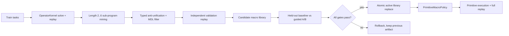

# Active Macro Self-Learning

## 목적

이 기능은 작은 모델 또는 deterministic search가 매번 같은 primitive operator 조합을
처음부터 찾지 않도록, 검증된 proof에서 반복 절차를 학습해 탐색 prior로 재사용한다.

여기서 macro는 새로운 사실을 직접 만드는 강력한 operator가 아니다. 다음 안전 계약을
지키는 **primitive-expanded procedural memory**다.

1. 학습 데이터는 성공하고 replay까지 통과한 proof만 사용한다.
2. macro는 등록된 primitive operator 이름과 schema fingerprint만 보존한다.
3. 실행 시 현재 registry의 schema가 정확히 일치해야 활성화된다.
4. macro는 현재 실행 가능한 `GroundAction`의 순위만 바꾼다.
5. kernel은 기존 primitive action을 하나씩 실행한다.
6. 성공 결과는 전체 primitive proof를 다시 replay한다.

따라서 신경망, LLM, macro library 어느 것도 임의의 `Fact`를 증명 상태에 넣을 수 없다.

## 데이터 흐름



## 핵심 구성 요소

### `MdlMacroLibrary`

`MdlMacroLibrary.induce(...)`는 proof 길이 2부터 6까지의 연속 sub-program을 조사한다.
후보는 다음 조건을 만족해야 보존된다.

- 서로 다른 verified trace에서 support 3 이상
- typed binding과 전제에서 효과로 이어지는 chaining이 유효함
- 동일 evidence 사이에서 primitive operator schema와 최종 effect type이 일치함
- description length가 기본 10% 이상 감소함
- 독립 validation callback이 성공함

artifact format v2는 각 primitive의 `operator_schema_fingerprints`를 저장한다. v1 artifact도
읽을 수 있지만 fingerprint가 없으므로 실행 시 안전하게 거부된다.

### `operator_schema_fingerprint`

fingerprint에는 다음 구조가 포함된다.

- parameter와 variable type
- predicate와 function schema
- precondition과 effect 구조
- guard 이름, cost, family, tags, metadata

문제마다 달라지는 ground symbol 이름과 값은 제외한다. 그래서 `ada`, `x=2`, `red_1`처럼
새 grounding에는 전이할 수 있지만, primitive의 의미나 guard가 바뀌면 즉시 비활성화된다.

### `PrimitiveMacroPolicy`

활성 macro의 최종 effect type이 현재 goal과 관련될 때만 해당 primitive action에 bonus를
준다. 여러 action이 같은 최고 점수면 기존 policy의 action limit을 유지한다. 하나의
macro action만 명확히 앞서면 그 expansion에서는 action limit을 1로 줄일 수 있다.

이 policy는 effect를 실행하지 않으며 `WorldState`를 변경할 권한도 없다. 실제 적용 가능성,
typed binding, guard, effect 생성은 모두 `OperatorKernel`이 담당한다.

### `VerifiedMacroLearningLoop`

루프는 세 분할을 강제한다.

- `training_tasks`: macro 후보의 support를 수집한다.
- `validation_tasks`: 후보 sequence와 schema를 독립적으로 다시 검증한다.
- `heldout_tasks`: baseline과 macro-guided 탐색을 A/B 비교한다.

기본 승격 gate는 다음과 같다.

- guided solve rate 하락 1%p 이내
- proof soundness 100%
- false positive 0
- expansion 감소 10% 이상
- 최소 2개 도메인에서 expansion 개선
- 개선 도메인마다 실제 활성 macro 존재

현재 3도메인 평가에서는 더 엄격하게 최소 3개 도메인과 expansion 감소 50%를 요구한다.

## 사용 예

```python
from semop.kernel import (
    LearningSplit,
    MacroLearningBudget,
    VerifiedMacroLearningLoop,
    generate_macro_reuse_transfer_split,
    learning_tasks_from_synthetic,
)

split = generate_macro_reuse_transfer_split(seed=23)
train = learning_tasks_from_synthetic(
    split.training,
    split=LearningSplit.TRAIN,
)
validation = learning_tasks_from_synthetic(
    split.validation,
    split=LearningSplit.HELDOUT,
    namespace="validation",
)
heldout = learning_tasks_from_synthetic(
    split.heldout,
    split=LearningSplit.HELDOUT,
    namespace="heldout",
) + learning_tasks_from_synthetic(
    split.negative_controls,
    split=LearningSplit.HELDOUT,
    namespace="negative",
    expected_solved=False,
)

loop = VerifiedMacroLearningLoop(
    MacroLearningBudget(min_domains_improved=3)
)
result = loop.run(train, validation, heldout)

if result.promoted:
    loop.persist_promoted(result, "artifacts/active-macros.json")
```

`persist_promoted`는 승격 실패 시 파일을 전혀 건드리지 않는다. 승격 성공 시 같은
디렉터리의 임시 파일에 먼저 기록한 뒤 atomic replace한다.

## 재현 평가

```powershell
python tools/eval/evaluate_active_macro_learning.py
python -m pytest tests/test_typed_operator_macro_activation.py -q
```

기본 seed 23의 현재 기준 결과는 다음과 같다.

| 항목 | 결과 |
|---|---:|
| verified train traces | 9 |
| independent validation traces | 3 |
| retained and active macros | 3 |
| held-out positive expansions | 19 -> 6 |
| expansion reduction | 68.4% |
| proof soundness | 100% |
| false positives | 0 |
| artifact size | 약 3.8 KB |

평가 데이터는 언어 inheritance, exact linear equation, raster square proof를 사용한다.
train, validation, held-out ID가 분리되고 비전 이미지 digest도 겹치지 않는다. 각 도메인의
ground symbol, 수치 또는 픽셀 배치는 달라지지만 primitive program schema는 재사용된다.

## 현재 한계

이 기능은 검증된 반복 절차를 발견하고 재사용하는 bounded self-learning이다. 아직 다음을
달성한 것은 아니다.

- 자유 자연어에서 predicate와 grammar를 무감독으로 발명
- 자연 사진과 영상에서 새 visual concept를 자동 발견하고 검증
- 알려지지 않은 primitive operator 자체의 의미를 생성
- 장기 task를 스스로 수집하고 계속 실행하는 autonomous agent
- 실제 사용자 분포의 20/100-shot 학습 완료

다음 단계는 active macro와 tiny controller를 결합하되, 동일한 schema pinning, negative
control, replay, held-out promotion 계약을 유지하는 것이다.
