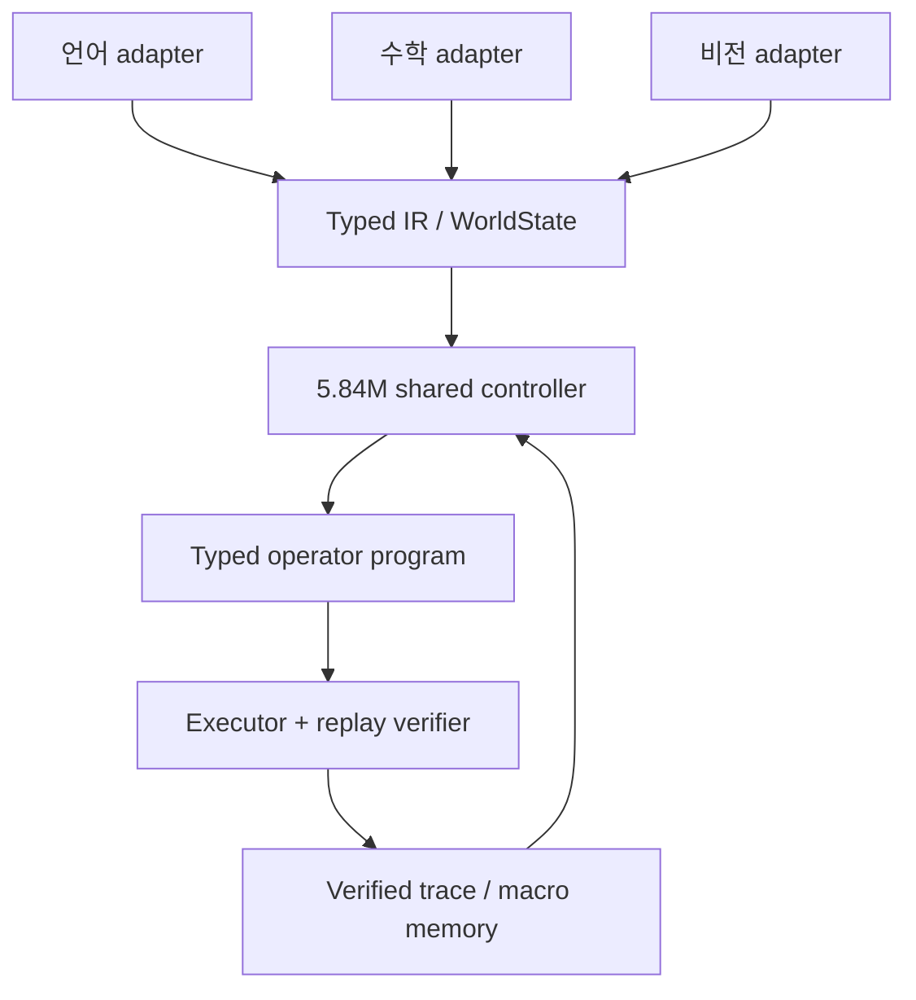

# 작은 뇌와 조합적 연산자 지능

## 우리가 만들려는 것

SemOp의 목표는 작은 모델이 언어·수학·비전의 답을 모두 암기하는 것이 아니다.
작은 공유 제어기가 현재 상태와 목표를 보고 typed operator와 인자를 선택하고,
검증기가 그 연산자 프로그램을 실행하며, 짧게 검증된 프로그램은 다시 조합 가능한
macro가 되는 구조를 목표로 한다.

```text
지능 = 작은 공유 제어기
     + typed world state
     + 많은 검증 가능한 operator 조합
     + 실패를 포함한 탐색 경험
     + 재사용 가능한 program memory
```

작은 모델의 파라미터 수보다 더 큰 경우의 수는 operator program의 조합 공간에서
나온다. 다만 조합 수가 크다는 사실만으로 지능이 생기지는 않는다. 타입이 잘못된
조합을 사전에 제거하고, 목표에 유용한 조합을 찾고, 실행 결과를 검증하고, 유용한
부분 프로그램을 재사용할 때 비로소 계산 자원이 감당 가능한 범위로 줄어든다.

## 공통 뇌와 도메인 경계

모든 도메인은 `TypedDomainAdapter`를 통해 같은 계약으로 들어온다.



공유 controller는 raw 문장, 숫자 이름, 픽셀을 직접 답으로 바꾸지 않는다. 입력
adapter가 만든 타입·관계·목표·증명 상태와 실행 가능한 action을 본다. 현재 action
표현에는 다음 정보가 포함된다.

- schema 이름
- 도메인 중립 operator family
- typed precondition/effect signature
- argument type과 pointer 대상
- cost와 재사용 tag

기본 family는 `observe`, `relate`, `transform`, `compare`, `quantify`, `control`,
`search`, `verify`, `memory`, `compose`다. 도메인별 이름이 달라도 같은 family와
구조를 공유하면 제어기가 조합 전략을 전이할 수 있다.

## 언어·수학·비전의 역할

### 언어

문장 표현은 `GOAL`, `REQUIRES`, `BLOCKED_BY`, 시간 순서, 지시 대상 같은 typed
relation으로 변환한다. 파서의 불확실한 출력은 `proposed` fact이며 바로 증거가 되지
않는다. 언어 지능의 검증 단위는 문장 생성 점수보다 전제 복원, 모순 회피, 목표 보존,
operator trace다.

### 수학

수식·도형·알고리즘을 exact term과 predicate로 변환한다. 대수 변환, 비교, 치환,
귀납 단계, 탐색 연산자는 guard와 effect를 갖는다. 최종 답이 맞더라도 재실행할 수 없는
중간 단계는 성공으로 인정하지 않는다. 현재는 기하·격자와 함께 정확한 유리수 산술
AST를 operator program으로 컴파일하고 각 연산을 guard에서 재검산한다.

### 비전

비전 encoder는 객체·기하·시간 관계 후보를 제안하되 직접 확정하지 않는다. detector,
기하 계산, 다중 프레임 일관성처럼 사용할 수 있는 verifier가 `proposed`를 `observed`
또는 `derived` 근거로 승격한다. 현재는 기존 VLSO의 `SharedWorldModel`뿐 아니라 RGB
행렬과 ASCII PNM을 읽는 dependency-free component detector도 연결했다. 완전히 분리된
bbox와 실제 pixel 접촉만 검증하고, 중심점 추정과 confidence만 높은 관계는
`proposed`로 남긴다. 자연사진 의미 detector는 아직 범위 밖이다.

## 조합을 학습하는 데이터

무작위 문장 분할은 이름 암기를 측정하기 쉽다. 이 프로젝트는 다음 축으로 train/test를
분리한다.

- 처음 보는 operator 조합
- 처음 보는 관계 그래프 구조
- 학습보다 긴 program depth
- 더 큰 문제 크기
- 도메인 하나를 제외한 leave-one-domain-out

학습 신호는 verifier가 재실행한 정답 trace, 명시적으로 인증된 목표 무관 hard
negative, `0/5/20/100`개의 사람 검토 trace다. 같은 proof에서 나중에 필요한 action은
실행 순서만 다를 수 있으므로 negative로 취급하지 않는다. 실패 trace도 탐색 정책에는
중요하지만 사실 memory에는 들어가지 않는다.

## 재귀와 macro

공유 message block을 반복하는 것은 작은 모델에 추가 계산 시간을 주는 방법이지,
정답을 보장하는 방법이 아니다. 모든 recurrent 출력은 action ranking일 뿐이다.

반복해서 성공한 길이 2~6 program은 typed anti-unification과 MDL 압축을 거친다.
support 3, 10% 이상 압축, 타입·효과 검증, held-out 무회귀를 통과한 macro만 retained
library에 들어간다. macro도 primitive program으로 펼쳐 replay한다.

## 코드 정리 원칙

새 typed 경로가 있다는 이유만으로 legacy 코드를 바로 삭제하지 않는다. 다음 순서를
모두 통과해야 제거한다.

1. `tools/maintenance/audit_code_surface.py`로 import, export, test, entrypoint 근거 수집
2. shadow telemetry에서 실제 호출과 결과 차이 확인
3. typed A/B gate와 기존 회귀 테스트 통과
4. persisted artifact와 CLI 호환성 확인
5. 한 기능군씩 삭제하고 다시 benchmark

정적 감사에서 후보가 되었다는 사실만으로 `deletion_ready`가 되지 않는다. 동적 import,
GUI, 저장 artifact가 있기 때문이다. 반대로 새 코어 안에서 executor를 우회하거나 아무
곳에서도 사용되지 않는 helper와 import는 즉시 제거한다.

## 현재 위치

현재 구현은 한 `UnifiedTypedReasoner`와 한 policy가 언어·수학·비전의 typed action을
선택할 수 있는 MVP다. 언어는 기존 graph 외에 명시적 한국어·영어 문장을 직접 받아
검증된 claim과 휴리스틱 후보를 분리하고 개념 포함 Horn chain을 실행한다. 수학은 정확
산술·정확 비교·한 변수 일차방정식, raster 비전은 공간 관계와 filled
shape·goal-independent closed count·pixel area를 같은 proof 계약으로 다룬다.
공통 registry composer로 이 operator들을 한 proof에 연결한 비전→수학→언어 경로도
실행한다. 36-case suite는 기대 성공 25건을 모두 검증하고 음성 대조군 11건을 모두
거절했으며, 별도 composed suite의 양성 2건과 음성 2건도 정확히 처리했다. Agenda
refactor와 operator frontier로 총 expansion은 `156 -> 81`이었다.
label leakage를 차단한 5.84M LODO smoke는 언어·수학 held-out median을 30% 이상 줄이며
비전 distractor에도 전이했다. 다만 새 Horn distractor는 `15 -> 13`으로 약했고 이
증거는 typed goal-binding에 한정된다. 다음 승격 기준은 사람 검토
20-shot이 100-shot verified solve rate의 90%에 도달하고 실제 문장·수식·자연영상 분포
이동에서도 같은 결과를 유지하는지다.
