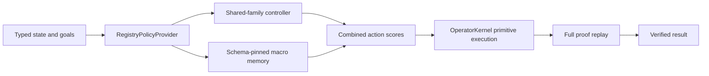

# Hierarchical Operator Brain

## 목적

`HierarchicalOperatorBrain`은 작은 shared controller와 검증된 operator program memory를
하나의 CPU-friendly inference artifact로 결합한다. 두 구성요소의 역할은 다르다.

- controller는 현재 상태에서 operator family, typed argument, goal 구조를 보고 action을
  고른다.
- macro memory는 과거 verified proof에서 반복된 primitive operator 조합을 prior로 준다.
- `OperatorKernel`만 action을 실행하고 fact를 추가할 수 있다.
- 모든 성공 proof는 primitive step으로 다시 replay된다.

이는 모델이 답을 생성하는 구조가 아니라 작은 선택기가 많은 검증 가능한 조합을 빠르게
찾는 구조다.

## 실행 구조



brain은 `policy_for(registry)`를 구현한다. 같은 artifact를 언어, 수학, 비전 registry에
전달하면 해당 registry에서 schema fingerprint가 맞는 macro만 활성화된다. provider 생성이
실패하거나 잘못된 policy를 반환하면 kernel은 전체 deterministic budget으로 복귀한다.

## 중간 Sub-Program 재사용

초기 macro policy는 macro의 마지막 effect가 최종 goal과 직접 일치할 때만 활성화됐다. 이
조건으로는 이미 배운 2-step 절차를 더 긴 3-step proof의 중간 부품으로 쓸 수 없다.

현재 `PrimitiveMacroPolicy`는 registry의 operator dependency를 type signature 수준에서
거꾸로 탐색한다.

1. 최종 goal predicate와 argument type을 relevant set에 넣는다.
2. relevant effect를 만드는 operator를 찾는다.
3. 그 operator의 precondition signature를 relevant set에 추가한다.
4. 고정점까지 반복한다.
5. macro effect가 closure 안에 있으면 현재 proof의 간접 sub-program으로 취급한다.

이 분석은 action 순위만 바꾼다. ground argument가 실제로 맞는지, guard가 참인지, effect가
새 사실인지 여부는 기존 typed executor가 매 단계 다시 확인한다.

## 독립 승격 분할

`HierarchicalSelfLearningLoop`는 한 held-out을 여러 선택에 재사용하지 않는다.

| 분할 | 용도 |
|---|---|
| controller training | 언어에서만 shared `verify` family와 action 구조 학습 |
| controller held-out + negatives | 언어 내부의 보지 못한 operator 이름으로 controller 후보 승격 |
| macro training | 반복 primitive program 유도 |
| macro validation | sequence와 schema 독립 재검증 |
| macro held-out + negatives | active macro 승격 |
| joint held-out + negatives | 두 구성요소가 확정된 뒤 최종 결합 gate |

기본 leave-domain-out 평가는 controller training과 controller held-out에서 언어 task만
선택한다. 수학과 비전 task는 controller 선택에 전혀 쓰지 않고 마지막 joint held-out에서
처음 평가한다. 또한 controller와 joint held-out의 completion operator 이름은 전부 다르다.
따라서 현재 평가는 특정 operator 이름이나 도메인별 schema 암기보다 `family:verify`,
effect-goal 관계, typed 구조가 언어에서 수학·비전으로 전이되는지를 측정한다. 비전 입력
digest도 모든 양성 분할 사이에서 겹치지 않는다.

## Joint Gate

최종 brain은 다음 조건을 모두 통과할 때만 활성화된다.

- controller component가 자체 held-out에서 승격됨
- macro component가 validation과 자체 held-out에서 승격됨
- joint solve rate가 최선 component보다 1%p 이상 하락하지 않음
- proof soundness 100%
- false positive 0
- deterministic 대비 기본 30% 이상 expansion 감소
- joint expansion이 controller-only와 macro-only보다 모두 작음
- 언어, 수학, 비전에서 활성 macro schema가 존재함
- 15M parameter, 64 MiB artifact, p95 10초 제한 통과
- 모든 성공 proof의 primitive replay 통과

어느 gate라도 실패하면 candidate brain은 반환되더라도 active brain으로 승격되지 않는다.
`persist_promoted`는 기존 artifact를 수정하지 않는다.

## Portable Artifact

brain artifact는 표준 라이브러리 JSON만 사용하며 다음을 포함한다.

- base policy kind와 artifact suffix
- base policy bytes의 Base64와 SHA-256
- 복원 시 검증할 parameter count
- macro library format v2 payload와 canonical SHA-256

load 시 learner kind, base hash, macro hash, 실제 복원 parameter count를 모두 확인한다. 저장은
같은 디렉터리의 임시 파일을 완전히 쓴 뒤 atomic replace한다.

## API 예

```python
from semop.kernel import (
    HierarchicalSelfLearningLoop,
    generate_hierarchical_brain_transfer_split,
    hierarchical_learning_tasks_from_curriculum,
)
from semop.tiny_controller import TinyControllerPolicyLearner

split = generate_hierarchical_brain_transfer_split(seed=23)
tasks = hierarchical_learning_tasks_from_curriculum(
    split,
    controller_domain="language",
)
learner = TinyControllerPolicyLearner(
    epochs=10,
    learning_rate=1e-3,
)
result = HierarchicalSelfLearningLoop(learner=learner).run_tasks(tasks)

if result.promoted:
    result.active_brain.solve(a_domain_instance)
    HierarchicalSelfLearningLoop.persist_promoted(
        result,
        "artifacts/hierarchical-brain.json",
    )
```

## 재현 평가

```powershell
python tools/eval/evaluate_hierarchical_self_learning.py
python tools/eval/evaluate_hierarchical_self_learning.py `
  --controller-profile recurrent-diagnostic --controller-epochs 5
python tools/eval/evaluate_hierarchical_self_learning.py `
  --controller-profile recurrent-full --controller-epochs 10
python -m pytest tests/test_typed_operator_hierarchical_brain.py -q
```

기본 seed 23의 현재 결과는 다음과 같다.

| 경로 | positive expansions |
|---|---:|
| deterministic | 22 |
| controller-only | 14 |
| macro-only | 22 |
| joint | 10 |

- deterministic 대비 joint 감소: 54.5%
- controller 학습: 언어 3개, 승격 holdout은 언어 양성 1개와 음성 1개
- zero-shot controller 평가 도메인: 수학, 비전
- active macro: 3개, 언어·수학·비전 각각 1개
- proof soundness: 100%
- false positives: 0

같은 split을 learner만 바꿔 비교한 결과는 다음과 같다. recurrent 학습은 replay-verified
언어 decision 3개와 terminal halt 3개만 사용한다.

| controller | parameters | updates | combined artifact | 학습 포함 wall time |
|---|---:|---:|---:|---:|
| sparse | 16 | 1 | 4,443 B | 약 0.13초 |
| recurrent diagnostic | 29,834 | 60 | 약 152 KiB | 약 1.6초, 첫 PyTorch import 포함 약 4.8초 |
| recurrent full | 5,837,578 | 60 | 28,858,505 B | 약 7.0초 |

세 profile 모두 위 표의 expansion `22 / 14 / 22 / 10`을 동일하게 기록한다. full profile의
추가 peak RSS는 약 470 MiB이고 joint p95 CPU inference는 약 0.016초였다. diagnostic
profile은 curriculum seed 19~25의 7회 반복에서 모두 같은 expansion과 전체 gate 통과를
재현했다. 이 과정에서 서로 다른 curriculum 역할의 raster layout이 특정 seed에서 겹칠 수
있던 누수를 발견해 source와 partition 축을 독립 인코딩하도록 수정했다.

macro-only가 긴 joint task 전체를 줄이지 못하는 것도 중요한 ablation 결과다. macro는 중간
절차를 안내하지만 마지막에 처음 보는 completion action을 고르는 일반 prior가 없다.
controller-only는 언어에서 배운 family prior로 처음 보는 math와 vision completion을 잘
고르지만 language 중간 chain을 줄이지 못한다. joint가 두 경로보다 작은 expansion을 기록해
도메인 간 전이와 두 기억 체계의 상보성을 함께 증명한다.

## 현재 한계

이번 결과는 sparse뿐 아니라 29K와 5.84M recurrent CPU controller의 실제 학습·NumPy
복원·joint 승격까지 검증한다. 다만 학습 데이터는 사람이 검토한 자유 자연어가 아니라 합성
언어 trace 3개이고, 현재 세 도메인 task는 controlled language inheritance, exact linear
equation, deterministic raster square proof다.
현재 정량 gate의 방향도 언어에서 controller를 학습한 뒤 수학과 비전을 zero-shot으로 보는
경우다. 다른 출발 도메인과 서로 다른 proof 길이까지 공정하게 비교하는 대칭 전이 평가는
별도 curriculum이 필요하다.

아직 남은 핵심 범위는 다음과 같다.

- 사람 검토 데이터의 0/5/20/100-shot recurrent joint 실험
- 자유 자연어 predicate와 operator schema 획득
- 자연 이미지와 영상의 learned proposal 및 독립 verifier 확장
- 새로운 primitive operator와 typed guard 후보 발명
- 여러 세대의 task discovery, memory consolidation, forgetting 평가
