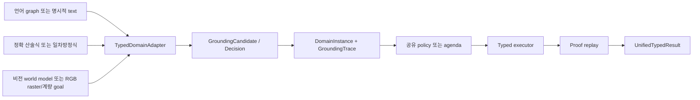

# 언어·수학·비전 Typed Runtime

## 현재 구현 범위

세 영역이 하나의 거대 모델에 직접 답을 요구하지 않고, 같은 typed kernel 계약으로
들어오도록 연결했다.

| 영역 | 입력 경계 | 검증 가능한 현재 능력 | 아직 하지 않는 것 |
| --- | --- | --- | --- |
| 언어 | `LanguageInputAdapter` | graph, 명시적 전제 텍스트, 한국어·영어 단항·conjunctive Horn 추론 | 자유 문장 전체의 의미 증명 |
| 수학 | `MathInputAdapter` | 정확한 유리수 산술·비교와 한 변수 일차방정식의 정규화·풀이 | 다변수·비선형 방정식, 미적분, 자연어 수학 전반 |
| 비전 | `VisionInputAdapter` | symbolic/RGB 공간 관계, filled shape, goal-independent closed count, pixel area 비교 | 자연사진 의미 인식, 미검증 detector 출력의 확정 |

모든 adapter는
`DomainInstance(registry, state, goals, domain, metadata, grounding_trace)`를 반환한다.
`grounding_trace`는 세 영역에 공통인 candidate, authority, verifier decision과 입력
digest를 보존한다. 자세한 권한 표와 자가학습 라벨 경계는
`docs/typed_grounding_boundary.md`에 있다.
`UnifiedTypedReasoner`는 영역과 무관하게 같은 `OperatorKernel.solve`와 proof replay를
호출한다.
공개 `UnifiedTypedReasoner.ground`는 실행과 자가 학습이 공유하는 adapter 경계다.
`RawSelfLearningLoop`는 이 경계를 사용해 raw 예제를 typed task로 바꾸고, 실패와
train/held-out fingerprint 중복을 검사한 뒤 verifier-gated learner를 실행한다.

## 실행 흐름



정책은 이미 타입 검사를 통과한 `GroundAction`의 순위만 정한다. 정책이 사실을 직접
추가하거나 halt만으로 성공을 선언하는 API는 없다.

v3에서는 `compose_domain_instances`로 서로 다른 registry를 타입 안전하게 합치고,
작은 raster의 개수를 exact 비교한 뒤 언어 분류로 이어지는 하나의 proof program도
지원한다. 자세한 계약은 `docs/composed_operator_runtime.md`에 있다.

## 빠른 실행

```powershell
$env:PYTHONPATH = "src"
python examples/typed_multidomain_demo.py
```

공개 API의 최소 형태는 다음과 같다.

```python
from semop.kernel import TypedDomainRequest, UnifiedTypedReasoner

result = UnifiedTypedReasoner().run(
    TypedDomainRequest("math", "(2 + 3) * 4", "shadow")
)
assert result.success and result.verified
print(result.proof_ko)
```

Raw 입력 자가 학습 API와 language-only 학습 뒤 math/pixel 전이 측정은
`docs/raw_grounded_self_learning.md`에 있다.

실행 모드는 세 영역에 공통이다.

- `legacy`: typed kernel을 실행하지 않는다.
- `shadow`: typed 결과를 반환하지만 원본 graph/world를 변경하지 않는다.
- `typed`: replay를 통과한 trace만 원본의 audit/projection 필드에 반영한다.

불변 `DomainInstance`를 직접 넣은 경우에는 투영할 legacy 객체가 없으므로 결과만
반환한다.

## 영역별 신뢰 경계

### 언어

`LanguageInputAdapter`는 기존 `StructuredMeaningGraph`와 `str`/
`LanguageTextProblem`을 함께 받는다. 기존 graph의 알려진 관계는 보존하고, 알 수 없는
relation은 `verified=False` predicate와 `proposed` fact로 남긴다. 텍스트 입력은
명시적인 한국어·영어 목표/필수 전제/충족/차단 문장을 `observed`로 변환한다. 기존
휴리스틱 fallback이 만든 후보는 전부 `proposed`이며 proof에 사용할 수 없다. 숨은
목표의 준비 여부는 각 문제에 명시된 필수 전제들의 유한 conjunction operator로
컴파일한다. 지원 문법과 모순 처리의 자세한 계약은 `docs/language_text_adapter.md`에
있다. `Every/모든`과 `Prove:/증명:` 형식은 별도의 `LanguageLogicAdapter`로 분기되어
개념 포함 추이성, 개체 분류 상속, 최대 8개 전제의 conjunctive Horn rule을 합성한다.
명시적 부정은 guard에서 충돌 도출을 차단하며 contraposition은 수행하지 않는다.

### 수학

산술식은 recursive-descent parser로 AST가 된다. 각 AST 노드는 구조 fact와 ground
operator가 되며, operator guard가 `fractions.Fraction`으로 결과를 다시 계산한다.
초기 상태에는 `VALUE` fact가 없으므로 최종 숫자는 operator 실행 없이 나타날 수 없다.
최상위 비교 기호 `< <= > >= == !=`가 있으면 양쪽 산술 proof를 조합하고 exact
`COMPARISON_TRUE` guard를 실행한다. `=`가 있는 입력은 `LinearEquationAdapter`로
분기한다. 양변을 exact linear form으로
파싱한 뒤 `NORMALIZED_LINEAR`, `SOLUTION` 두 operator를 실행하고 guard가 `Fraction`으로
각 변환을 다시 계산한다. legacy 직접 방정식 풀이도 이 경로와 replay를 재사용한다.

### 비전

confidence는 검증의 대체물이 아니다. 현재는 relation attributes의 `verified`,
`geometry_verified`, `symbolically_verified` 중 하나가 참이고 최소 confidence를 넘은
지원 relation만 `observed`가 된다. 나머지는 높은 confidence라도 `proposed`이며 proof
전제로 사용할 수 없다. `RIGHT_OF`, `BELOW`, `CONTAINS`는 안전한 canonical inverse로
정규화한다.

`RasterVisionAdapter`는 RGB 행렬이나 ASCII PNM에서 4-neighbor color component를 찾고
완전히 분리된 bbox 순서와 실제 pixel 접촉만 독립 검증한다. bbox가 겹쳐 중심점으로만
추정한 관계는 `proposed`에 머문다. 자세한 객체 id, 자원 상한, 확장 계약은
`docs/raster_vision.md`에 있다.

같은 component fact에서 최소 2x2 filled rectangle과 equal extent를 합성해 square를
증명하고, segmentation을 통과한 closed component 집합의 개수와 정확한 pixel area도
ground guard로 재검산한다. 관측 모드에서는 최종 goal 없이도 요청된 count와 모든
component 사이의 area 비교 operator를 준비하므로 뒤쪽 질문이 비전 사실을 누설하지
않는다. component는 기본 256개로 제한한다.

## 평가

```powershell
python tools/eval/evaluate_low_resource_transfer.py `
  --suite language-math-vision `
  --run-fast-tests
```

2026-07-17의 36-case baseline은 기대 성공 25건을 모두 풀고 음성 대조군
11건을 모두 거절해 reported proof soundness 100%를 기록했다. 실제 한국어·영어 전제,
conjunctive Horn chain과 모순, exact 비교·방정식과 wrong solution, raw-pixel
공간·도형·개수·면적 및 미검증 대조군을 포함한다. `GoalDirectedPolicy`는 전체
expansion을 156개에서 81개로
낮췄고 언어·수학 domain median은 각각 33.3%, 37.5% 감소했다. 비전 전용 공간-chain
distractor는 13개에서 1개로 줄었다.

별도 `composed-v4` suite는 실제 비전→수학→언어 program 8건을 평가한다. 양성 5건은
각각 `3, 3, 5, 5, 4` step proof로 검증하고, 거짓 threshold·명시적 부정·거짓 conjunct
3건은 거절했다. 전체 expansion은 `47 -> 34`, proof soundness는 100%, false
positive는 0건이었다.

5.84M controller를 도메인별로 하나씩 제외하고 나머지 영역의 synthetic trace 20개씩
5 epoch 학습한 LODO에서도 soundness와 solve rate 100%를 유지했다. 언어 median은
`3 -> 2`, 수학은 `6.5 -> 4`였고 비전 전용 distractor는 `13 -> 1`이었다. 새 Horn
distractor 자체는 `15 -> 13`으로 약하므로 세 영역을 일반적으로 해결했다는 증거는
아니다. reviewed 20/100-shot gate가 비어 있으므로 `shadow`가 계속 기본값이다.

2026-07-18의 shared grounding 최종 검증에서 typed suite는 263건과 subtest 20건을
51.38초에 통과했고, 전체 회귀는 630건과 subtest 20건을 330.99초에 통과했다.
goal-directed baseline의 작은 문제
p95는 약 0.006초, 큰 문제 p95는 약 0.016초였다. 이 수치는 현재 개발 PC의 회귀
스냅샷이며 하드웨어 독립 성능 보장은 아니다.

2026-07-20의 현재 전체 회귀는 `716 passed, 34 subtests passed`였고 286.69초가
걸렸다. 이 수치는 위의 과거 단계별 스냅샷을 대체하지 않고, 현재 branch head의
통합 상태만 기록한다.

다음 실험은 실제 사람 검토 trace로 `0/5/20/100` shot 곡선과 자연 분포 이동을
측정해야 한다.

## 연구 선택 기준

현재 구현은 논문 구조를 통째로 복제하지 않고, 일반 PC와 적은 데이터라는 제약에 맞는
부분만 가져온다.

- 언어: [PICARD](https://aclanthology.org/2021.emnlp-main.779/)와
  [Grammar-Constrained Decoding](https://aclanthology.org/2023.emnlp-main.674/)처럼
  자유 생성 뒤의 낙관적 해석보다 허용된 typed 구조를 먼저 제한한다. 현재는 작은
  결정적 parser가 이 역할을 하며, 향후 모델 출력도 candidate 권한만 갖는다.
- 수학·공유 제어기: [A Generalist Neural Algorithmic Learner](https://proceedings.mlr.press/v198/ibarz22a.html)는
  여러 알고리즘이 processor를 공유할 가능성을 보여 주지만, 입력 의미와 정답 검증을
  대신해 주지는 않는다. SemOp은 공유 controller를 action 순위에만 쓰고 exact executor를
  신뢰 경계 안에 둔다.
- 비전: [Slot Attention](https://proceedings.neurips.cc/paper/2020/hash/8511df98c02ab60aea1b2356c013bc0f-Abstract.html)의
  object-centric 표현은 장기 frontend 후보지만, 자연 이미지 grounding 정확도를 아직
  입증하지 않았으므로 v1은 deterministic raster observation만 `observed`로 승격한다.

이 구분은 세 영역을 이미 정복했다는 주장이 아니다. 지금 달성한 공통 기반은
`candidate -> typed fact -> operator program -> replay`이고, 앞으로 학습해야 할 부분은
주로 candidate 생성과 action 순위다.

학습 smoke test도 같은 세 영역을 기본으로 사용한다.

```powershell
python tools/train/train_tiny_controller.py `
  --output artifacts/tiny_lmv_debug.npz `
  --curriculum language-math-vision `
  --examples-per-domain 1 `
  --epochs 1 `
  --debug-small
```

## 확장 절차

1. 입력을 immutable typed fact와 명시적 goal로 바꾸는 adapter를 만든다.
2. 모델 추정치는 기본적으로 `proposed`로 두고 독립 verifier의 승격 조건을 적는다.
3. 공용 catalog의 relation operator를 우선 재사용한다.
4. 새 operator에는 positive replay, wrong-target, unverified-input 테스트를 붙인다.
5. 구조·조합·크기 split을 benchmark에 추가한다.
6. shadow A/B가 통과한 뒤에만 기존 문자열 실행 경로를 한 기능군씩 제거한다.
