# Online Verified Self-Learning

## 목적

이 경로는 언어, 수학, 비전의 실제 typed runtime 실행에서 실패와 외부 제안을
지속적으로 모으고, 독립 검토된 사례만 새 operator rule의 근거로 사용하는 작은
자가 학습 루프다. 학습기가 사실을 직접 추가하거나 성공을 선언할 권한은 없다.

현재 구현이 학습하는 것은 두 종류다.

- 기존 operator 중 무엇을 먼저 실행할지 정하는 작은 search policy
- 반복되는 typed 전제와 목표 사이의 flat Horn rule

자유 문장의 전체 의미, 자연 이미지의 객체 개념, 새로운 수학 primitive를 스스로
발명하는 단계는 아직 아니다.

## 전체 흐름

```mermaid
flowchart LR
    A["LMV raw request"] --> B["UnifiedTypedReasoner"]
    B --> C["proof-replayed result"]
    C --> D["TypedExperienceCollector"]
    D --> E["append-audited SQLite queue"]
    J["user or frontier judge proposal"] --> E
    E --> F["independent human review"]
    F --> G["precommitted four-way partition"]
    G --> H["raw grounding and leakage audit"]
    H --> I["VerifiedRuleLearningLoop"]
    I --> K["final joint holdout gate"]
    K -->|pass| L["hash-checked active library"]
    K -->|fail| M["incumbent library unchanged"]
    L --> N["explicit runtime augmenter"]
```



## 모듈 경계

- `semantic_codec.py`
  - 언어, 수학, raster 비전 raw request를 canonical JSON으로 직렬화한다.
  - domain과 payload가 같으면 언제나 같은 SHA-256 request digest를 만든다.
  - `legacy`와 composed request는 online semantic corpus에 넣지 않는다.
- `experience_queue.py`
  - 관찰 event와 review revision을 SQLite에 append-only 방식으로 기록한다.
  - event JSON, index column, digest가 다르면 읽기 단계에서 실패한다.
  - request 수, payload 크기, 전체 record 크기, proof 길이를 제한한다.
- `experience_collection.py`
  - production `UnifiedTypedReasoner.run` 결과를 관찰한다.
  - 미해결, runtime 예외, replay 실패, 예상 결과 불일치를 기본 수집한다.
  - 승인된 review를 네 split으로 grounding하고 cross-split 누수를 검사한다.
- `rule_discovery.py`, `rule_learning.py`
  - training에서 rule 후보를 만들고 validation과 candidate heldout에서 개별 반증한다.
  - 마지막 joint heldout에서 새 rule들의 조합까지 incumbent와 A/B 비교한다.
- `runtime.py`
  - 승격된 `VerifiedRuleLibrary`를 명시적 `augmenters` 인자로만 활성화한다.
  - 원본 registry를 복제하므로 adapter가 만든 instance를 제자리에서 변경하지 않는다.

## 라벨 권한

한 request에는 다음 세 결과가 서로 분리되어 저장된다.

- `observed_success`: 현재 typed executor가 실제로 goal을 증명했는가
- `proposed_expected_solved`: 사용자, 생성기, frontier judge가 제안한 정답 라벨
- human review: exact request와 expected outcome을 사람이 별도로 확인했는가

사용자와 frontier LLM의 제안은 queue priority와 hard case 발견에는 사용할 수 있지만
그 자체로 semantic gold가 되지 않는다. `TypedExperienceStore.review`는 실수로 모델
identity가 들어오는 것을 막기 위해 `human:` reviewer id를 요구한다. 이 prefix는
암호학적 인증이 아니므로, 실제 서비스에서는 호출 계층이 reviewer 로그인을 인증해야
한다.

## 네 단계 split

DB를 처음 만들 때 `ExperiencePartitionConfig`가 함께 저장된다. 이후 같은 DB를 다른
seed나 bucket 비율로 열면 실패한다. request digest의 hash bucket으로 역할을 정하므로
리뷰 결과나 학습 성능을 본 뒤 사례를 유리한 split으로 옮길 수 없다.

| 역할 | 목적 | 기본 비율 |
| --- | --- | ---: |
| `train` | rule 후보 anti-unification | 50% |
| `validation` | 후보 선택과 첫 반증 | 20% |
| `candidate_heldout` | 선택된 개별 rule 재검증 | 15% |
| `joint_heldout` | 전체 library 상호작용 최종 평가 | 15% |

raw request digest가 달라도 같은 typed facts, goals, operator schema로 grounding되면
semantic duplicate로 간주한다. 네 역할 사이 input 또는 grounded semantic overlap이
하나라도 있으면 학습을 시작하지 않는다.

## 최소 API 흐름

```python
from semop.kernel import (
    ExperienceProposalAuthority,
    ExperienceReviewCorpusGrounder,
    RawExperienceGrounder,
    ReviewedExperienceRuleLearningLoop,
    TypedDomainRequest,
    TypedExperienceCollector,
    TypedExperienceStore,
    UnifiedTypedReasoner,
)

store = TypedExperienceStore("artifacts/experience/typed-experience.db")
reasoner = UnifiedTypedReasoner()
collector = TypedExperienceCollector(store, reasoner=reasoner)

run = collector.run(
    TypedDomainRequest(
        "language",
        "Goal: deploy; Requires: tests",
    ),
    proposed_expected_solved=False,
    proposal_authority=ExperienceProposalAuthority.FRONTIER_JUDGE,
    rationale="The judge expects the missing requirement to block deployment.",
)

# 이 호출은 인증된 사람 검토 UI 또는 운영 도구에서만 수행한다.
store.review(
    run.request_digest,
    expected_solved=False,
    phenomenon="missing_requirement",
    rationale="The required test evidence is absent in this exact input.",
    reviewer="human:reviewer-id",
    decision="approved",
)

corpus = store.export_reviewed()
grounder = ExperienceReviewCorpusGrounder(
    RawExperienceGrounder(reasoner, hard_negatives_per_example=0)
)
learning = ReviewedExperienceRuleLearningLoop(grounder=grounder).run(corpus)

if learning.promoted:
    active_reasoner = UnifiedTypedReasoner(
        augmenters=(learning.learning.active_library,)
    )
```

실제 rule 학습에는 네 역할이 모두 비어 있지 않아야 한다. 기본 설정에서는 corpus
전체가 언어, 수학, 비전을 모두 포함해야 하며 final joint split에는 학습된 각 domain의
positive와 negative가 모두 있어야 한다.

## 저장과 rollback

`ReviewedExperienceRuleLearningLoop`는 메모리에서 active library를 반환한다. 파일로
승격할 때는 `VerifiedRuleLearningLoop.persist_promoted`를 사용한다. joint gate가 실패한
결과는 저장되지 않으며 기존 artifact를 변경하지 않는다. 로드할 때 envelope SHA-256과
내부 library digest, promotion certificate를 모두 확인한다.

runtime 활성화는 다음처럼 명시적이다.

```python
active = VerifiedRuleLearningLoop.load_active(
    "artifacts/rules/active-rules.json",
    expected_sha256=checkpoint_sha256,
)
reasoner = UnifiedTypedReasoner(augmenters=(active,))
```

호환되지 않는 predicate schema의 rule은 사실을 추가하지 않고 activation issue로
기록된다. 호환되는 rule이 도출한 모든 성공 결과도 primitive proof replay를 다시
통과해야 한다.

## 검토 CLI

기존 DB의 partition 설정은 metadata와 fingerprint를 검사해 자동으로 다시 읽는다.

```powershell
python tools/eval/review_typed_experience.py `
  --db artifacts/experience/typed-experience.db stats

python tools/eval/review_typed_experience.py `
  --db artifacts/experience/typed-experience.db `
  list --status pending --limit 20

python tools/eval/review_typed_experience.py `
  --db artifacts/experience/typed-experience.db `
  show REQUEST_SHA256
```

사람이 `show`의 exact payload와 expected outcome을 모두 확인한 뒤에만 review를
기록한다.

```powershell
python tools/eval/review_typed_experience.py `
  --db artifacts/experience/typed-experience.db `
  review REQUEST_SHA256 `
  --expected unsolved `
  --phenomenon missing_requirement `
  --rationale "The exact input lacks required test evidence." `
  --reviewer human:reviewer-id `
  --decision approved `
  --attest-human-review
```

`--attest-human-review`가 없으면 어떤 review도 기록하지 않는다. 승인된 현재 revision은
다음처럼 감사 artifact로 내보낼 수 있다.

```powershell
python tools/eval/review_typed_experience.py `
  --db artifacts/experience/typed-experience.db `
  export --output artifacts/experience/approved-reviews.json
```

## 운영 체크리스트

1. DB partition seed와 비율을 실험 전에 고정한다.
2. frontier judge는 proposal만 기록하고 review API를 호출하지 못하게 한다.
3. 사람은 raw input과 expected outcome을 함께 확인한다.
4. pending, conflicted, approved, rejected 건수를 주기적으로 확인한다.
5. 네 split의 domain, positive, negative 분포를 승격 전에 확인한다.
6. semantic overlap이 발생하면 문구만 바꾸지 말고 독립 문제를 다시 수집한다.
7. candidate가 실패하면 rejection reason을 남기고 incumbent를 유지한다.
8. artifact와 certificate digest를 배포 설정에 함께 고정한다.

## 현재 한계

- online collector는 raw request와 논리 실행 결과를 모으지만 현실 세계 증거의 참을
  자동 확인하지 않는다.
- human reviewer prefix는 인증 시스템을 대신하지 않는다.
- rule discovery는 monotonic, single-effect, flat typed Horn rule로 제한된다.
- delete effect, 시간 상태 전이, 모순 철회, branch-local planning은 아직 없다.
- 자연어와 자연 영상의 open-domain grounding은 학습 대상이 아니다.
- controller와 rule library의 장기 동시 online update는 아직 자동 scheduler가 없다.

따라서 현재 기능의 정확한 이름은 `review-gated online typed rule learning`이다.
완전 자율 의미 학습이라고 부르지 않는다.

## 검증

```powershell
python -m pytest tests/test_typed_operator_experience_queue.py -q
python -m pytest tests/test_typed_operator_experience_collection.py -q
python -m pytest tests/test_typed_operator_rule_discovery.py -q
python -m pytest tests -k typed_operator -q
python -m pytest
```

통합 테스트는 다음을 확인한다.

- 언어 미해결, 수학 parsing 실패, 비전 judge 제안의 자동 수집
- 보통의 replay-verified 성공을 기본적으로 저장하지 않는 sampling 정책
- proposal과 human-reviewed label의 권한 분리
- SQLite idempotency, digest 변조 탐지, resource limit
- deterministic 네 단계 partition과 cross-role semantic leakage 차단
- 검토된 runtime 실패에서 rule 발견, joint promotion, 새 심볼 전이
- 승격된 library의 명시적 runtime activation과 proof replay
