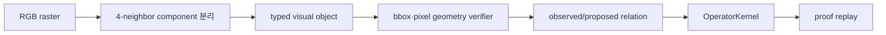

# 저자원 Raster Vision Adapter

## 목적

`RasterVisionAdapter`는 이미 만들어진 scene graph가 아니라 RGB 픽셀에서 출발하는
최소 비전 경로다. 큰 CNN이나 OpenCV 없이 다음 순서로 작은 operator program을 만든다.



현재 목표는 자연사진 인식 성능이 아니라, 픽셀 관찰과 symbolic proof 사이의 신뢰
경계를 작고 재현 가능하게 만드는 것이다.

## 지원 입력

- `RasterImage.from_rows(...)`: 메모리의 grayscale/RGB 행렬
- `RasterImage.from_pnm(...)`: 표준 라이브러리만 사용하는 ASCII P1/P2/P3 파일
- `RasterImage.from_file(...)`: PNM은 기본 지원, PNG/JPEG 등은 optional Pillow 사용
- 최대 픽셀 수, 최소 component 면적, 배경·색상 tolerance 설정
- 단색 component의 `LEFT_OF`, `ABOVE`, `TOUCHING` 관계

```python
from semop.kernel import (
    RasterImage,
    RasterVisionProblem,
    TypedDomainRequest,
    UnifiedTypedReasoner,
    VisionAreaGoal,
    VisionCountGoal,
    VisionPropertyGoal,
    VisionRelationGoal,
)

white = (255, 255, 255)
red = (255, 0, 0)
blue = (0, 0, 255)
image = RasterImage.from_rows(
    ([white] * 7, [white, red, red, white, blue, blue, white], [white] * 7)
)
problem = RasterVisionProblem(
    image,
    (VisionRelationGoal("LEFT_OF", "red", "blue"),),
)
result = UnifiedTypedReasoner().run(
    TypedDomainRequest("vision", problem, "shadow")
)
assert result.success and result.verified
```

전체 실행 예제는 `examples/typed_raster_vision_demo.py`에 있다.

## 도형·개수·면적 목표

공간 관계 외에도 같은 component fact를 다음처럼 조합할 수 있다.

```python
problem = RasterVisionProblem(
    image,
    (
        VisionPropertyGoal("SQUARE", "red"),
        VisionCountGoal("all", 2),
        VisionAreaGoal("red", "blue"),
    ),
)
```

- `SQUARE`는 최소 2x2의 실제 filled bounding box와 같은 너비·높이를 함께 요구한다.
- `VisionCountGoal`은 segmentation 설정을 통과한 component 집합을 closed world로 센다.
- `VisionAreaGoal`은 bbox가 아니라 component의 정확한 pixel 수를 비교한다.

따라서 빈 테두리, L자 component, 틀린 개수, 반대 면적 관계는 증명되지 않는다. 개수의
closed-world 범위와 무시된 작은 component 수는 결과 metadata에 기록된다.

## 객체 이름

component는 색상과 위·왼쪽 순서로 정규화되어 `red_1`, `red_2`, `blue_1`처럼 이름을
얻는다. 같은 색상이 하나뿐이면 goal에서 `red`처럼 짧은 selector를 쓸 수 있다. 같은
색 component가 여러 개면 모호성을 추측하지 않고 사용 가능한 id를 포함한 오류를 낸다.

## 신뢰 경계

- bbox가 완전히 분리된 축 관계와 실제 4-neighbor 접촉은
  `deterministic_pixel_geometry` provenance를 가진 `observed` fact다.
- bbox가 겹치고 중심점 순서만 있는 관계는 confidence와 관계없이 `proposed`다.
- `proposed`와 `contradicted`는 proof 전제가 될 수 없다.
- 멀리 떨어진 순서 관계는 입력 fact를 늘리지 않도록 transitive reduction하고,
  `LEFT_OF`/`ABOVE` operator가 proof에서 다시 조합한다.
- 성공한 결과는 다른 도메인과 동일하게 ground action을 replay해야 한다.

여기서 검증된 것은 설정된 픽셀 분할에 대한 기하 명제다. 실제 사진 속 물체의 의미,
깊이, 가림, 조명 불변성을 검증한 것은 아니다.

## 자원 상한

component 탐색은 픽셀 수에 선형이고, 관계 생성은 검출 객체 수에 대해 이차다.
`RasterVisionConfig.max_pixels` 기본값은 1,000,000이며 초과 입력은 처리 전에 거절한다.
core runtime 의존성은 추가되지 않았다. 일반 이미지 파일이 필요할 때만
`python -m pip install -r requirements-vision.txt`로 Pillow를 설치한다.

## 작은 학습 모델 연결점

향후 작은 detector나 encoder는 `RasterObject` 후보와 mask를 제안할 수 있다. 모델
출력은 처음에는 `proposed`로 두고, mask 일관성·다중 프레임·기하 계산처럼 독립된
검증을 통과한 관계만 `observed`로 승격한다. 이후 단계의 typed operator, controller,
proof replay는 교체하지 않는다. 이 분리가 작은 모델의 조합 능력을 활용하면서도
hallucinated relation이 사실 상태에 직접 들어오는 것을 막는다.

## 검증

```powershell
python examples/typed_raster_vision_demo.py
python -m pytest tests/test_typed_operator_raster_vision.py -q
python tools/eval/evaluate_low_resource_transfer.py --suite language-math-vision
```

공식 suite에는 픽셀에서 만든 transitive positive와 centroid-only negative control이
각각 포함되며, filled square, closed count, pixel area와 그 음성 대조군도 검사한다.
