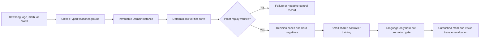

# Raw-Grounded Self-Learning

## 목적

`RawSelfLearningLoop`는 사용자가 미리 `DomainInstance`를 만들지 않아도 언어 문자열,
수학 문자열, 작은 RGB raster를 자가 학습 경계에 넣을 수 있게 한다. 내부 정책이
학습하는 대상은 여전히 답 자체가 아니라 **현재 goal에 유용한 typed operator와
인자의 순서**다.

현재 구현은 범용 자율 학습의 완성이 아니다. 지원 adapter가 확실하게 해석할 수 있는
입력을 typed IR로 바꾸고, verifier가 성공 proof를 만든 경우에만 그 trace를 정책
학습에 사용하는 bounded self-learning 경로다.



## 공개 API

```python
from semop.kernel import (
    LearningSplit,
    RawLearningExample,
    RawSelfLearningLoop,
    TypedDomainRequest,
)

training = (
    RawLearningExample(
        "train-deploy",
        TypedDomainRequest(
            "language",
            "Goal: deploy; Requires: tests; Satisfied: tests",
        ),
    ),
)
heldout = (
    RawLearningExample(
        "heldout-publish",
        TypedDomainRequest(
            "language",
            "Goal: publish; Requires: review; Satisfied: review",
        ),
        split=LearningSplit.HELDOUT,
    ),
)

result = RawSelfLearningLoop().run(training, heldout)
assert result.grounding.leakage_free
print(result.promoted)
```

`UnifiedTypedReasoner.ground(request)`는 실행과 학습이 공유하는 단일 adapter 경계다.
`UnifiedTypedReasoner.run(request)`도 이 메서드를 호출하므로 학습용 grounding과 실제
실행용 grounding이 서로 다른 의미 변환을 사용하지 않는다.

## 경험 데이터 계약

`RawLearningExample`은 다음 정보를 가진다.

- `request`: domain, raw payload, migration mode
- `expected_solved`: verifier가 풀어야 하는 positive인지, 풀면 안 되는 control인지
- `split`: `train` 또는 `heldout`
- `source`: `verifier`, `synthetic`, `reviewed` 중 하나
- `capability`, `structure_key`, `difficulty`: 감사와 curriculum용 표식

`RawExperienceGrounder`는 각 입력에 대해 input fingerprint와 grounding 전 semantic
fingerprint를 기록한다. train/held-out에서 어느 하나라도 겹치면 학습을 시작하지 않는다.
형식만 다르고 같은 typed state, goal, operator schema로 변환된 입력도 semantic overlap으로
차단한다.

다음 오류는 조용히 버리지 않고 `GroundingFailure`로 보존한다.

- `legacy` mode여서 typed verifier trace를 만들 수 없음
- 이미 만든 `DomainInstance`여서 raw adapter 경계를 우회함
- adapter가 입력을 해석하지 못함
- adapter 결과에 명시적 typed goal이 없음
- 잘못된 source, domain, type 또는 task metadata

`require_complete()` 또는 `require_ready()`가 호출되면 기록된 실패를
`RawGroundingError`로 묶어 발생시킨다. training과 held-out은 비어 있을 수 없고, split
label과 example id도 두 집합 전체에서 검사한다.

## Hard Negative와 신뢰 경계

각 raw example에는 최대 4개의 실행 가능한 wrong-goal operator를 붙일 수 있다. 이들은
정답 predicate의 타입은 맞지만 다른 인자를 효과로 내므로, controller가 이름 암기가
아니라 goal-effect 구조를 구분하도록 만든다.

- hard negative가 만든 fact도 typed executor를 통해서만 추가된다.
- wrong-goal fact는 실제 goal을 충족하지 않는다.
- `proposed`와 `contradicted` fact는 proof 전제로 승격되지 않는다.
- 성공 trace는 `OperatorKernel.replay`를 다시 통과해야 corpus에 들어간다.
- controller는 action을 정렬할 뿐 fact나 성공 판정을 직접 만들 수 없다.
- held-out soundness, false-positive, solve-rate, expansion, 크기, 시간 gate를 모두
  통과한 artifact만 활성 정책이 된다.

trace metadata에는 `experience_input_fingerprint`,
`experience_semantic_fingerprint`, source domain, hard-negative 수가 남는다. 따라서 모델
artifact와 별개로 어떤 raw 경험에서 supervision이 생겼는지 추적할 수 있다.

## 실행과 측정

dependency-free sparse 경로:

```powershell
python tools/eval/evaluate_raw_grounded_self_learning.py `
  --controller-profile sparse
```

PyTorch 학습 후 NumPy CPU 추론 경로:

```powershell
python -m pip install -r requirements-train.txt
python tools/eval/evaluate_raw_grounded_self_learning.py `
  --controller-profile recurrent-diagnostic `
  --controller-epochs 5
python tools/eval/evaluate_raw_grounded_self_learning.py `
  --controller-profile recurrent-full `
  --controller-epochs 5
```

2026-07-18, seed 31의 한 개발 PC 측정은 다음과 같다. 세 profile 모두 원시 언어
positive 3개로 학습하고, 언어 positive/negative 각 1개로만 승격을 결정했다. 그 뒤
학습과 선택에 사용하지 않은 원시 일차방정식과 RGB square 문제, 거짓 대조군을
평가했다.

| profile | parameters | updates | artifact | wall time | 추가 peak RSS |
| --- | ---: | ---: | ---: | ---: | ---: |
| sparse | 23 | 1 | 1,166 B | 0.04 s | 0.82 MiB |
| recurrent diagnostic | 29,834 | 60 | 114,507 B | 5.24 s | 250.0 MiB |
| recurrent full | 5,837,578 | 60 | 21,641,875 B | 7.26 s | 448.4 MiB |

세 profile의 양성 expansion은 수학 `6 -> 2`, 비전 `6 -> 2`였다. reported proof
soundness는 100%, false positive는 0이었고 저장 artifact를 복원한 결과도 proof와
expansion이 같았다. 이 결과는 **goal-effect 구조의 작은 표본 전이**를 보여 주지만,
언어·수학·비전을 일반적으로 이해했다는 증거는 아니다.

구현 회귀는 다음 명령으로 확인한다.

```powershell
python -m pytest tests/test_typed_operator_raw_experience.py
python -m pytest -k typed_operator
python -m pytest
```

이번 변경의 최종 실행에서는 raw experience 9건, typed operator 199건과 subtest 20건,
전체 저장소 566건이 통과했다. 전체 회귀 시간은 개발 PC에서 261.61초였다.

## 현재 한계와 다음 단계

- 언어: 명시적 goal/requirement/status와 제한된 Horn 문법만 grounding한다. 자유 문장에서
  새 predicate와 문법을 스스로 발명하지 않는다.
- 수학: exact 산술, 비교, 한 변수 일차방정식 범위다. 자연어 문제와 새 정리 발견은
  아직 없다.
- 비전: 작은 색상 component와 exact pixel geometry를 사용한다. 자연사진 detector나
  시간 변화 표현은 학습하지 않는다.
- 데이터: 로컬 curriculum을 자동 수집하거나 웹에서 무제한 자기 생성하지 않는다.
- 평가: 현재 raw transfer set은 작고 통제되어 있다. 여러 seed, 구조 분리, 실제 사람
  검토 `0/5/20/100` 곡선이 더 필요하다.

다음 확장은 frontier LLM이나 detector 출력을 곧바로 사실로 믿는 것이 아니다. 출력은
`proposed` candidate로 받고, typed program 실행, proof replay, held-out 무회귀를 통과한
trace만 학습 경험으로 승격해야 한다.
