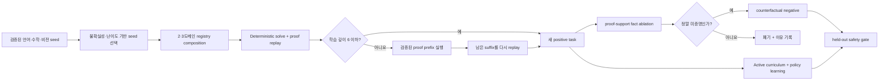

# Verifier-Backed Task Discovery

## 목적

기존 자가 학습 루프는 사람이 미리 정의한 언어·수학·비전 capability pool에서
학습 대상을 골랐다. 이 단계는 검증된 seed task를 바탕으로 새로운 operator 조합과
counterfactual을 **스스로 제안하고 검증해** curriculum을 확장한다.

여기서 "스스로"는 임의의 정답이나 fact를 발명한다는 뜻이 아니다. 발견기는 typed
task를 제안할 수 있지만, 채택 여부는 항상 기존 registry의 operator 실행과 proof
replay 결과로 결정된다.

이 문서의 discovery 대상은 **새 학습 task와 counterfactual**이다. 실행 가능한 새
Horn 규칙을 귀납하는 별도 경계는 `verified_rule_discovery.md`를 참고한다. 두 기능은
후보를 제안할 수 있을 뿐이며, 어느 쪽도 typed executor와 proof replay를 우회하지
않는다.



## 발견 연산자

### Domain Composition

`VerifiedTaskDiscovery`는 서로 다른 도메인의 `DomainInstance`를
`compose_domain_instances`로 합친다. 현재 후보는 다음 형태다.

- 언어 + 수학
- 언어 + 비전
- 수학 + 비전
- 언어 + 수학 + 비전

합성 registry는 타입, predicate, function, guard와 operator 충돌을 기존 composition
계약으로 처리한다. 새 task는 여러 독립 목표를 한 상태에서 해결해야 하므로 작은
controller가 도메인을 번갈아 가며 operator 순서를 선택하는 연습이 된다.

### Verified Suffix Scaffold

합성 proof가 synthetic trace 제한인 깊이 6보다 길면 정답을 잘라 저장하지 않는다.
먼저 전체 proof를 replay한 뒤 앞부분의 action을 실제 executor로 실행해 새 초기 상태를
만든다. 남은 suffix를 다시 처음부터 solve하고 replay했을 때 깊이 6 이하인 경우에만
학습 task로 채택한다.

held-out 발견은 이 scaffold를 사용하지 않고 최대 깊이 12의 전체 조합을 유지한다.
따라서 학습은 짧은 verified suffix를 사용하고 평가는 더 긴 새 operator 조합에서
이루어진다.

### Support Ablation

positive proof의 premise 중 초기 상태에 있던 fact를 하나 제거한다. 목표 label만 false로
바꾸는 것이 아니라 변형된 상태를 다시 solve한다. 다른 경로로 목표가 여전히 증명되면
후보를 폐기하고, 실제로 미증명일 때만 counterfactual negative로 채택한다.
이 negative는 action label 학습에는 사용하지 않고 promotion의 false-positive gate에만
추가한다.

## 실패와 불확실성

policy가 주어지면 discovery 우선순위는 다음 신호를 사용한다.

- gold action과 hard negative 사이의 score 불확실성
- proof 깊이와 조합 component 수
- guided policy가 목표를 해결하지 못한 경우의 failure bonus

policy 예외 뒤 deterministic fallback이 성공하더라도 policy 자체의 성공으로 세지 않는다.
평가용 held-out task discovery는 현재 policy를 보지 않고 독립적으로 실행한다. 이 원칙은
평가 문제를 현 정책의 약점에 맞춰 유리하게 만드는 누수를 막는다.

## 데이터 계보와 중복 제거

각 `DiscoveryCandidateRecord`는 다음 정보를 남긴다.

- parent task ID와 mutation 종류
- capability/structure key
- 정규화된 replay program signature
- proof 깊이와 scaffold step 수
- baseline/policy expansion과 policy 성공 여부
- 제거한 counterfactual fact
- 채택 여부와 모든 rejection reason

이름만 다른 seed는 composition 전에 `duplicate_seed_structure`로 제거된다. 생성 task도
source와 같은 program이거나 이미 발견한 structure/program과 같으면 채택되지 않는다.

## 자원 제한

`TaskDiscoveryBudget`의 기본 제한:

| 항목 | 기본값 |
|---|---:|
| seed task | 12 |
| domain별 seed | 4 |
| composition 후보 | 64 |
| positive task | 12 |
| counterfactual negative | 12 |
| component 수 | 3 |
| 학습 proof 깊이 | 6 |
| 후보 검증 proof 깊이 | 12 |
| positive당 ablation 시도 | 8 |

따라서 조합 수나 premise 수가 커져도 무제한 생성과 검증을 수행하지 않는다.

## 실행

```powershell
python examples/typed_self_discovery_demo.py `
  --output artifacts/self_discovery_01 `
  --examples-per-structure 1
```

Machine-readable 평가:

```powershell
python tools/eval/evaluate_typed_task_discovery.py `
  --examples-per-structure 1 `
  --output artifacts/self_discovery_eval.json
```

현재 deterministic seed 41 실행 결과:

- training seed 6개에서 positive composition 12개 발견
- 각 positive에서 검증된 counterfactual 1개, 총 12개 발견
- 독립 held-out seed에서 전체 composition 4개와 negative 4개 발견
- synthetic training proof 깊이 최대 6
- held-out 발견 proof 깊이 최대 9
- train/held-out structure overlap 0, replay-program overlap 0
- positive expansion `86 -> 43`, 50% 감소
- verified solve rate 100%, proof soundness 100%, false positive 0
- sparse policy 24 parameters, 1,190-byte artifact
- 학습 폐루프 약 2.1초, 추가 peak RSS 약 2.85MB

## Python API

```python
from semop.kernel import (
    SelfDiscoveringLearningLoop,
    VerifiedTaskDiscovery,
)

discovery = VerifiedTaskDiscovery().discover(training_seeds)

result = SelfDiscoveringLearningLoop().run(
    training_seeds,
    heldout_tasks,
)
```

## 현재 한계

이 구현은 **기존 typed operator와 검증된 seed의 조합 공간** 안에서 task를 발견한다.
아직 다음 능력을 뜻하지 않는다.

- 자유 자연어에서 새로운 predicate schema나 문법을 발명
- 자연 이미지·영상에서 알려지지 않은 visual concept를 자동 정의
- 새로운 predicate, guard, perception primitive 또는 비단조 상태 전이를 발명
- 실제 사용자 실패 로그를 지속적으로 수집하는 온라인 학습
- 여러 generation에 걸친 task mutation tree와 장기 망각 복구

flat single-effect Horn 규칙은 이제 별도의 사람 검토 validation과 untouched held-out
반증을 통과하면 hash-checked library 후보가 될 수 있다. 다음 단계의 자가 학습은 실제
입력 실패를 typed failure record로 축적하고, 이 rule library와 검증된 macro operator,
새로운 perception schema를 장기 rollback 가능한 승격 경계에 연결하는 것이다.
