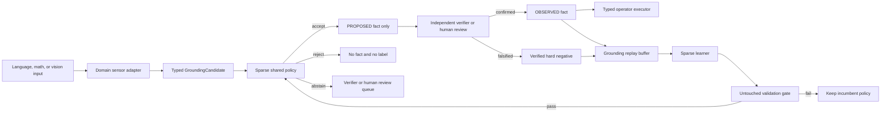

# Sparse Grounding Self-Learning

## Purpose

This milestone learns the decision immediately before typed operator reasoning.
Language, math, and vision adapters produce a `GroundingCandidate`; one small
dependency-free policy predicts `ACCEPT`, `REJECT`, or `ABSTAIN`.

The trust boundary is strict:

- policy `ACCEPT` means only "stage a proof-ineligible proposal"
- policy `REJECT` is not a verified hard negative
- only a deterministic adapter, independent verifier, or explicit human review
  can create a training label
- only those independent authorities can promote an accepted proposal to an
  observed fact
- operator proof replay remains a separate later verification layer

This is grounding-policy optimization, not autonomous truth creation.

## Data Flow



## Components

### Candidate sensor contract

`GroundingCandidate.sensor_features` carries bounded numeric measurements from a
domain adapter. Examples include parser exactness, a numeric residual, detector
confidence, or direct pixel measurement availability.

The contract rejects feature names containing label or verifier-decision terms such
as `label`, `verdict`, `accepted`, `rejected`, or `verified`. This does not make a
malicious producer trustworthy; it prevents accidental label leakage. A model
proposal remains untrusted regardless of feature values.

The current adapters expose label-independent feature schemas:

- language: controlled-parser match, heuristic path, claim arity, parser confidence
- math: exact-parser path, expression arity, linear/comparison structure
- vision: imported-input shape, detector confidence, direct pixel measurement shape

### Shared sparse encoder

`grounding_features.py` creates a bounded sparse vector from:

- anonymized symbol and entity names
- predicate arity, term shape, and nominal argument types
- shared sensor feature names
- domain-private hashed surface tokens
- language, math, and vision surface-shape features

Entity names and raw input digests are excluded from the feature vector. If a
candidate includes a sensor feature contract, every active shared sensor feature
must have verified training support. A new sensor channel therefore forces
`ABSTAIN`, even when generic type features are familiar.

### Selective policy

`SparseGroundingPolicy` is a logistic sparse head with a symmetric reject region.
The default threshold is `0.75`:

- `p(accept) >= 0.75`: accept as proposal
- `p(accept) <= 0.25`: reject as model opinion
- otherwise: abstain

Inference uses only the Python standard library. The artifact is deterministic,
JSON encoded, SHA-256 checked by the store, and usually only a few kilobytes.

### Verified continual replay

`VerifiedGroundingLearningLoop` trains a candidate and compares it with the
incumbent on a caller-supplied validation split. Promotion checks:

- raw input, candidate, and record lineage do not overlap train and validation
- both accept and reject labels are represented
- required language, math, and vision coverage is reached
- selective accuracy and coverage gates pass
- false accepts remain below the explicit limit
- parameter and artifact limits pass

`VerifiedGroundingOnlineLearningLoop` merges newly verified examples with prior
replay, retrains from the incumbent, and increments the generation only after the
same gate passes. A failed update leaves the active policy unchanged. Repeated
records do not create a fake generation.

## Minimal API

```python
from semop.tiny_controller import (
    GroundingLearningBudget,
    VerifiedGroundingOnlineLearningLoop,
)

online = VerifiedGroundingOnlineLearningLoop(
    budget=GroundingLearningBudget(
        required_domains=("language", "math", "vision"),
        max_false_accepts=0,
    )
)

first = online.update(training_examples, validation_examples)
second = online.update(
    newly_verified_examples,
    validation_examples,
    state=first.state,
)

prediction, proposal = second.state.active_policy.stage_if_accepted(candidate)
# proposal is None, or a FactStatus.PROPOSED record. It is never OBSERVED here.
```

Abstained and low-confidence proposals can be prioritized without manufacturing a
label:

```python
from semop.tiny_controller import select_grounding_review_candidates

review_queue = select_grounding_review_candidates(trace, policy, limit=20)
```

## Evaluation

Run the fixed contract-level benchmark:

```powershell
python tools/eval/evaluate_grounding_self_learning.py `
  --checkpoint-root artifacts/grounding_self_learning `
  --output artifacts/grounding_self_learning/report.json
```

The 2026-07-18 local run used `0/5/20/100` independent synthetic verifier labels per
domain, a separate promotion set, and 50 untouched test examples per domain.

| labels per domain | parameters | artifact | test coverage | selective accuracy | false accepts |
| ---: | ---: | ---: | ---: | ---: | ---: |
| 0 | 0 | 249 B | 0.0% | no decisions | 0 |
| 5 | 64 | 5,653 B | 86.7% | 100% | 0 |
| 20 | 64 | 5,658 B | 88.7% | 100% | 0 |
| 100 | 64 | 5,792 B | 90.0% | 100% | 0 |

The benchmark intentionally includes a novel sensor contract in the untouched set;
those cases should abstain. It measures whether the trust contract and selective
learner work. It does not measure open-domain language semantics, natural-image
recognition, or human-reviewed semantic correctness. The report records
`human_semantic_gold_evaluated=false` and `human_reviewed_labels=0`.

The evaluator also runs the production controlled-text, exact-arithmetic, and
in-memory raster adapters. In the recorded probe they emit respectively `3`, `5`,
and `5` grounding records; every record has a sensor contract and every materialized
fact is covered by its grounding trace. Language contributes no verified learning
label in this probe because explicit text is not independent real-world evidence.

Metrics include per-domain coverage, selective accuracy, false accepts, false
rejects, Brier score, and empirical area under the risk-coverage curve (AURC).

## Research Basis

- [SelectiveNet](https://proceedings.mlr.press/v97/geifman19a.html) formalizes the
  risk-coverage tradeoff and motivates an explicit abstain path.
- [Selective Classification via One-Sided Prediction](https://proceedings.mlr.press/v130/gangrade21a.html)
  motivates treating false positives as a first-class constraint rather than hiding
  them inside aggregate accuracy.
- [Experience Replay for Continual Learning](https://papers.nips.cc/paper_files/paper/2019/hash/fa7cdfad1a5aaf8370ebeda47a1ff1c3-Abstract.html)
  motivates retaining verified old examples when new domains arrive.
- [DAgger](https://proceedings.mlr.press/v15/ross11a.html) motivates reviewing
  examples from the learner-induced distribution, especially abstentions and
  failures, instead of training once on a fixed easy corpus.
- [Concept Bottleneck Models](https://proceedings.mlr.press/v119/koh20a.html)
  motivates the inspectable typed concept boundary between sensors and reasoning.

This implementation borrows the operational principles, not the papers' statistical
guarantees. In particular, the fixed sparse threshold is not conformal calibration.

## Current Limits And Next Evidence

The production-adapter semantic bridge is now implemented in
`semantic_grounding_self_learning.md`. Controlled raw text, exact expressions, and
RGB rasters replace the artificial consistency signal in that evaluator. The fixed
run promotes the 20- and 100-label policies, reaches a 91.7% 20-to-100 completion
ratio, and reports zero false accepts. Five labels per domain remain insufficient
and correctly roll back.

The next scientific gate still requires evidence that this repository does not yet
contain:

1. digest-bound human semantic labels at `0/5/20/100` for all three domains
2. natural-language paraphrase and relation-direction near misses
3. natural-image object and relation candidates from a small learned visual encoder
4. exact math candidates with wrong constants, boundaries, and operator structure
5. a calibration split and confidence intervals across at least 20 seeds
6. a final untouched semantic test that is never used for threshold or model choice

Until those exist, this module is the verified learning substrate for grounding, not
evidence that SemOp has solved language, mathematics, or vision.

## Verification

```powershell
python -m pytest tests/test_typed_operator_grounding_learning.py -q
python -m pytest tests/test_typed_operator_grounding_eval.py -q
python -m pytest -k typed_operator
python -m pytest
```
