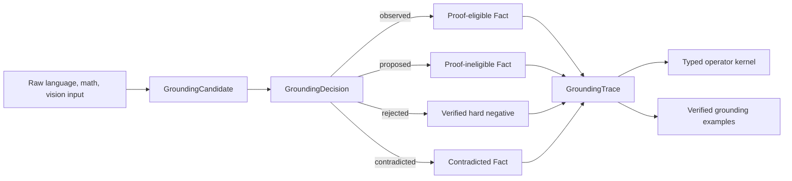

# Typed Grounding Boundary

## 목적

SemOp의 작은 공통 뇌는 raw 언어, 수식, 픽셀을 직접 정답으로 바꾸지 않는다. 먼저
각 입력에서 typed concept 후보를 만들고, 후보가 어떤 권한과 증거로 world state에
들어왔는지 기록한 뒤 operator search를 시작한다.

이 경계가 필요한 이유는 세 영역에서 `verified`가 서로 다른 뜻으로 사용되기 쉽기
때문이다.

- 언어: 문장에 주장이 명시적으로 적혀 있다는 뜻
- 수학: parser와 exact arithmetic이 구조를 다시 계산했다는 뜻
- 비전: 픽셀 배열에서 component나 공간 관계를 결정론적으로 측정했다는 뜻

어느 것도 자동으로 현실 세계의 완전한 의미 정확도를 보장하지 않는다.

## 공통 데이터 흐름



공개 구조는 다음과 같다.

- `GroundingCandidate`: atom, 입력 digest, producer, confidence, evidence reference
- `GroundingDecision`: disposition, authority, verifier, evidence status, rationale
- `GroundingRecord`: 후보와 결정을 실제 `Fact` 또는 기각 결과에 결속
- `GroundingTrace`: 한 `DomainInstance`의 불변 grounding ledger
- `GroundingLearningExample`: 독립 검증 또는 사람 리뷰가 라벨링한 학습 예제

`DomainInstance`는 trace에 materialize된 fact가 실제 초기 `WorldState`에 없으면 생성을
거절한다. registry composition도 atom을 새 registry로 remap하면서 assertion,
evidence, confidence와 trace lineage를 보존한다.

## 권한 규칙

| authority | `OBSERVED` 생성 | 대표 사용처 |
| --- | --- | --- |
| `EXPLICIT_INPUT` | 가능, 보통 evidence는 `UNVERIFIED` | 통제 문법, 명시된 graph assertion |
| `DETERMINISTIC_ADAPTER` | `ADAPTER_VERIFIED`일 때만 가능 | exact math parser, RGB pixel measurement |
| `EXTERNAL_VERIFIER` | `EXTERNAL_VERIFIED`일 때만 가능 | 독립 도메인 시스템 검증 |
| `HUMAN_REVIEW` | `human:` reviewer와 외부 검토 증거가 있을 때 가능 | 검토 큐 승인 |
| `MODEL_PROPOSAL` | 불가능 | 작은 neural grounder, frontier judge |
| `HEURISTIC_PROPOSAL` | 불가능 | 언어 fallback, centroid 추정 |
| `IMPORTED_PROPOSAL` | 불가능 | 외부 scene graph의 미검증 relation |

confidence는 authority를 바꾸지 않는다. confidence가 `0.999`인 모델 relation도 독립
검증 전에는 `PROPOSED`이며 proof premise로 사용할 수 없다.

## 세 영역의 현재 매핑

### 언어

명시적 `Goal`, `Requires`, `Satisfied`, `Blocked` 문장은
`EXPLICIT_INPUT + UNVERIFIED evidence + OBSERVED`다. 문서에 해당 assertion이 있다는
사실은 논리적으로 사용할 수 있지만, 실제 승인이나 완료가 외부 시스템에서
확인됐다는 뜻은 아니다. legacy heuristic과 미등록 graph relation은 proposal이다.

### 수학

산술 AST, 일차방정식의 양변 linear form, exact comparison request는
`DETERMINISTIC_ADAPTER + ADAPTER_VERIFIED + OBSERVED`다. 결과 값은 초기 fact로 넣지
않고 typed operator와 guard가 다시 계산한다.

### 비전

RGB component, pixel area, component color, bounding-box fill과 exact extent는
결정론적 측정이다. 완전히 분리된 bbox 관계와 실제 pixel 접촉도 같은 경로를 쓴다.
centroid-only 관계, confidence-only detector relation, 미검증 entity는 proposal이다.

## 검증된 자가학습 수명주기

```python
proposed = stage_grounding_proposal(
    candidate,
    authority=GroundingAuthority.MODEL_PROPOSAL,
    verifier_id="tiny-grounder-v1",
    rationale="model proposed a typed relation",
    confidence=0.82,
)

reviewed = review_grounding_proposal(
    proposed,
    approved=False,
    reviewer_id="human:reviewer-01",
    rationale="the relation direction is reversed",
)

trace = GroundingTrace((reviewed,))
negative = trace.learning_examples[0]
```

`learning_examples`에는 다음 record만 들어간다.

- deterministic adapter가 확인한 accept/reject
- independent external verifier가 확인한 accept/reject
- 명시적 사람 리뷰가 확인한 accept/reject

다음 항목은 자동 학습 라벨에서 제외한다.

- 아직 unresolved인 model/heuristic proposal
- 단지 입력에 명시됐을 뿐 외부 의미 증거가 없는 언어 assertion
- verifier replay 없이 생성된 설명이나 confidence

독립 verifier나 사람 리뷰에서 거절된 proposal만 `REJECT` hard negative가 된다.
모델이 자기 후보를 거절한 판정은 학습 라벨로 쓰지 않는다. 승인된 proposal은 기존
record digest를 `supersedes_record_digest`로 남긴다. persistent review queue와 split audit은
`online_verified_self_learning.md`의 기존 계약을 그대로 따른다.

## 연구 근거

이 구조는 다음 연구를 작은 자원 환경에 맞게 좁혀 적용한다.

- [DreamCoder](https://arxiv.org/abs/2006.08381)는 symbolic library와 neural search
  guidance를 함께 학습하고, 검증된 프로그램을 재사용 가능한 abstraction으로 압축한다.
- [AlphaGeometry](https://www.nature.com/articles/s41586-023-06747-5)는 neural model이
  symbolic deduction의 어려운 branching을 안내하는 neuro-symbolic 분업을 보인다.
- [Concept Bottleneck Models](https://proceedings.mlr.press/v119/koh20a.html)은 raw 입력과
  최종 예측 사이에 사람이 교정 가능한 고수준 concept을 둔다.
- [Neuro-Symbolic Concept Learner](https://arxiv.org/abs/1904.12584)는 object scene과
  문장을 executable symbolic program으로 연결한다.
- [Slot Attention](https://papers.nips.cc/paper_files/paper/2020/hash/8511df98c02ab60aea1b2356c013bc0f-Abstract.html)은
  픽셀에서 조합 가능한 object-like slot을 만드는 비전 front-end의 후보 방향이다.
- [Generalist Neural Algorithmic Learner](https://arxiv.org/abs/2209.11142)는 한 graph
  processor가 여러 algorithm task를 공유할 가능성을 보이지만, 각 task의 단일 학습
  가능성이 먼저 확보되어야 한다는 한계도 함께 보여 준다.
- [SelectiveNet](https://proceedings.mlr.press/v97/geifman19a.html)의 reject option은 작은
  grounder가 모르는 입력을 억지로 확정하지 않고 abstain하도록 학습할 근거가 된다.

이 논문들이 SemOp의 open-domain 일반화를 입증하는 것은 아니다. 현재 구현은 이
가설들을 시험할 수 있도록 권한과 데이터 lineage를 코드 수준에서 분리한 단계다.

## 현재 검증 스냅샷

2026-07-18에 `language-math-vision` symbolic baseline을 다시 실행했다.

- replay-verified goal completion: `1.0`
- primitive replay integrity: `1.0`
- false positive: `0`
- policy solve-rate delta: `0.0`
- language/math median expansion reduction: 각각 `33.3%`, `37.5%`
- small/large p95 CPU gate: 통과

이 결과는 통제된 36-case symbolic suite의 실행 무결성이다. 사람 검토
`20/100-shot` artifact가 없으므로 overall gate는 `not_evaluated`이며 의미 정확도나
open-domain 언어·비전 능력의 증거로 사용하지 않는다.

## 다음 구현 순서

1. `GroundingLearningExample`을 입력으로 받는 sparse accept/reject/abstain head를 만든다.
2. language, math, vision별 calibration과 risk-coverage curve를 따로 측정한다.
3. 세 head의 typed concept embedding만 공유하고 domain-specific sensor encoder는 분리한다.
4. 사람 검토 0/5/20/100-shot split과 untouched test를 고정한다.
5. real-image object proposal은 object-centric encoder 뒤에서도 계속 `PROPOSED`로 둔다.
6. grounding 오류와 operator-search 오류를 평가 지표에서 별도 집계한다.

## 검증

```powershell
python -m pytest tests/test_typed_operator_grounding.py -q
python -m pytest -k typed_operator
python -m pytest
```

## Sparse Policy Update (2026-07-18)

The previously planned grounding-policy milestone is now implemented in
`semop.tiny_controller` without NumPy or PyTorch:

- anonymized typed and domain-sensor features
- sparse `ACCEPT/REJECT/ABSTAIN` inference
- verified accept/reject replay only
- raw-input and semantic-candidate split leakage checks
- continual replay with validation-gated promotion and rollback
- deterministic, hash-checked JSON artifacts
- per-domain risk, coverage, false-accept, Brier, and AURC metrics

An accepted model prediction still creates only a `PROPOSED` fact. The independent
promotion rules in this document have not changed. See
`sparse_grounding_self_learning.md` for the API, benchmark, and current limits.
