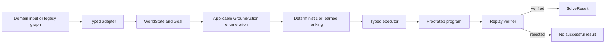

# Typed Operator Core v1

## Why This Core Exists

The original SemOp runtime contains useful parsers, memories, symbolic reasoners,
and product workflows, but many execution contracts are represented as strings.
`semop.kernel` adds a parallel verifier-first path where a controller may select an
operator program but cannot assert a fact directly.

The first milestone is deliberately narrow:

- immutable typed terms, facts, goals, operators, and proof steps
- nominal types with single inheritance
- typed and symmetry-aware unification
- goal-relevant agenda forward chaining with optional policy guidance
- complete proof replay before any success is returned
- geometry, hidden-premise, grid, exact arithmetic, and verified scene baselines
- one language/math/vision runtime with `legacy`, `shadow`, and `typed` modes

Raw-language generation, pixel perception, and unrestricted operator synthesis are
outside this core. Their existing outputs enter through typed adapters and remain
`proposed` until a verifier explicitly promotes them.

## Data Flow



The ranking policy sees only actions already grounded by the kernel. It has no API
for adding `Fact` objects. A predicted halt is ignored until every goal is present in
the verifier-eligible state.

## Public Model

Import the core contract from `semop.kernel`:

| Type | Role |
| --- | --- |
| `TypeSystem`, `TypeRef` | Nominal types and single-parent assignability |
| `Term`, `Symbol`, `Variable`, `TermApplication` | Immutable typed terms |
| `Predicate`, `Atom`, `Fact`, `Goal` | Typed propositions and state |
| `Rule`, `OperatorSpec`, `GroundAction` | Declarative and grounded operators |
| `WorldState`, `ProofStep` | Immutable search state and executable trace |
| `SolveBudget`, `SolveResult` | Resource limits, inference rounds, and verified result |
| `KernelRegistry`, `OperatorKernel` | Registration, search, execution, replay |
| `DomainInstance`, `TypedDomainAdapter` | Common domain boundary |
| `UnifiedTypedReasoner`, `TypedDomainRequest` | Language/math/vision orchestration |

Fact states are `observed`, `assumed`, `derived`, `proposed`, and `contradicted`.
Only the first three may satisfy a precondition, and their predicate must also be
marked `verified=True`.

## Geometry Example

```python
from semop.kernel import OperatorKernel, render_proof_ko
from semop.kernel.domains import parse_geometry_dsl

problem = parse_geometry_dsl("""
point A, B, M
let AM: Segment = segment(A, M)
assume midpoint(M, A, B)
prove equal_length(AM, segment(M, B))
""")

result = OperatorKernel(problem.registry).solve(problem.state, problem.goals)
assert result.success and result.verified
print(render_proof_ko(result))
```

The runnable symbolic example is `examples/typed_operator_demo.py`; the direct
language/math/vision path is `examples/typed_multidomain_demo.py`; the standalone
geometry input is `examples/typed_geometry_midpoint.geom`.

The DSL supports point/line/segment/angle declarations, typed aliases, comments,
nested terms, multiple assumptions, and multiple goals. Errors include source,
line, and column information.

## Adding An Operator

1. Register every nominal type before functions and predicates that use it.
2. Build variables through `KernelRegistry.variable`.
3. Build preconditions and effects through `KernelRegistry.atom`.
4. Register a pure named guard if structural checks are needed.
5. Register the `Rule`; registration rejects undeclared variables and effects whose
   variables are not bound by a precondition.
6. Add one positive replay test, one type-error test, and one negative control.
7. Add the case to the transfer benchmark only after its expected result is explicit.

```python
x = registry.variable("x", entity)
registry.register_operator(Rule(
    name="finish_seen",
    parameters=(x,),
    preconditions=(registry.atom("SEEN", x),),
    effects=(registry.atom("DONE", x),),
    description_ko="{x}를 확인했으므로 처리를 완료했다",
))
```

## Search And Replay

The default limits are 32 proof steps/inference rounds, 20,000 executed actions,
top 8 operator schemas, 4 argument candidates, and policy beam width 4. Because all
v1 effects are monotonic additions, unguided solving first computes a predicate-level
backward dependency slice and then applies applicable actions by deterministic agenda
rounds. It does not enumerate every subset of independently derived facts.

The kernel records the first producer of each derived atom. Once every goal appears,
it walks those producers backward, keeps only the supporting action DAG, topologically
linearizes it, and rebuilds state digests before mandatory replay. `proof` therefore
contains supporting actions while `inference_rounds` records breadth-wise derivation
depth. Minimum here means first deterministic inference round, not globally minimum
proof node count.

A policy sees the same type-checked agenda and selects up to `beam_width` actions per
iteration. A poor choice can add an irrelevant fact but cannot delete facts or bypass
verification. Exhaustion is complete for the monotonic state; budget exhaustion or a
policy exception uses deterministic fallback.

Guards used in a sliced proof must depend on bindings and declared preconditions. A
guard with hidden state dependencies may be valid during saturation but will be
rejected when the supporting trace is rebuilt or replayed.

## Legacy Migration

`StructuredMeaningPipeline(operator_backend=...)` accepts:

- `legacy`: run only the existing runtime
- `shadow`: return the legacy result and append typed timing, allocation, expansion,
  proof-overlap, and verification fields to `audit_trace`
- `typed`: additionally project replay-verified typed decisions into
  `operator_execution`

`shadow` is the default. Unknown legacy relations survive adaptation as unverified
proposed predicates, so information is not silently discarded and cannot
accidentally become proof evidence.

`UnifiedTypedReasoner` applies the same modes to explicit language, math, and vision
requests. Math v1 compiles exact rational AST nodes into guarded ground operators.
Vision v1 accepts a symbolic scene plus explicit typed goals; high confidence alone
never promotes a visual relation to proof evidence. See
`docs/language_math_vision_typed_runtime.md` for the trust boundary and examples.

## Known Limits

- The core is monotonic; explicit negation and belief revision are not implemented.
- Arithmetic v1 is exact but intentionally limited to rational `+ - * /` expressions.
- Vision accepts symbolic worlds plus a deterministic raster path for separated color
  components; it does not yet recognize semantic objects in natural photographs.
- Grid v1 proves symbolic reachability, not optimal path cost.
- Hidden-premise readiness uses an adapter-compiled all-requirements operator so it
  remains sound for each explicit requirement set.
- Macro operators are retained as verified program abbreviations; v1 expands them to
  primitive operator names rather than granting them direct fact-writing authority.
