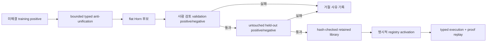

# Verified Typed Rule Discovery

## 목적

`VerifiedRuleDiscovery`는 기존 operator로 풀리지 않는 typed training task에서
작은 Horn 규칙 후보를 만들고, 별도의 사람 검토 validation과 untouched held-out
반증을 통과한 규칙만 실행 라이브러리에 보존한다.

이 기능은 operator 순서를 더 잘 고르는 policy learning과 다르다. 예를 들어 다음
구조가 반복되면 새로운 실행 규칙 후보를 만들 수 있다.

```text
REQUIRES(goal, premise) + SATISFIED(premise) -> READY(goal)
ADD_RESULT(a, b, total) -> EXACT_SUM(a, b, total)
LEFT_OF(a, b) + LEFT_OF(b, c) -> LEFT_OF(a, c)
```

신경망이나 LLM은 이 승격 경계를 우회할 수 없다. v1 후보 생성기는 결정론적이며,
retained rule도 일반 operator와 똑같이 typed executor와 proof replay를 거친다.



## 후보 생성 계약

v1은 의도적으로 작은 가설 공간만 탐색한다.

- training split의 positive task만 제안 근거로 사용한다.
- 기존 registry로 이미 풀리는 task는 규칙 발견 근거에서 제외한다.
- 하나의 goal과 1~3개 proof-eligible initial fact를 사용한다.
- 완전한 ground term을 해당 명목 타입의 변수로 취급해 이름과 값에 독립적인
  template을 만든다.
- effect의 모든 변수는 precondition에서 먼저 결속되어야 한다.
- 이미 등록된 동일 구조 규칙과 중복 후보는 제거한다.
- 서로 다른 training task ID의 최소 3회 support가 필요하다.
- 변수 수, 변수 순열, 후보 수, solve expansion과 timeout을 모두 제한한다.

후보는 이미 등록된 `verified=True` predicate만 참조할 수 있다. 새 predicate,
function, guard, 타입 또는 primitive perception operator를 발명하지 않는다.

## 검증과 반증

후보마다 원본 registry를 복제하고 후보를 임시 등록한다. 원본 task와 registry는
변경하지 않는다.

validation과 held-out에서 모두 다음 조건이 필요하다.

- 기존 operator만으로는 풀리지 않던 사람 검토 positive가 새로 풀린다.
- 성공 proof가 replay되고 실제로 후보 규칙을 사용한다.
- 사람 검토 negative는 계속 풀리지 않는다.
- 기존에 풀리던 positive를 보존한다.
- false positive, replay failure, regression이 하나도 없다.
- training에 등장한 각 도메인이 positive와 negative 증거에 모두 포함된다.

validation이 실패한 후보에는 held-out을 실행하지 않는다. 따라서 held-out은 후보
선택용 validation과 분리된 마지막 반증 집합으로 남는다.

## 리뷰 증거와 digest

retained record는 두 digest를 구분해 보존한다.

- `case_digest`: 사람이 검토한 원본 case와 expected outcome을 가리키는 digest
- `grounded_task_digest`: 평가에 실제 사용된 타입, predicate schema, 기존 operator,
  fact의 신뢰 상태, goal, expected outcome을 묶은 digest

또한 task ID, 도메인, positive/negative 방향, reviewer, timestamp와 attestation을
함께 기록한다. exact duplicate는 같은 split 안에서도 support를 부풀릴 수 없고,
training/validation/held-out 사이의 동일 typed instance 재사용도 거절한다.

이 증거는 평가 계보와 변경 탐지를 제공하지만 reviewer 신원을 암호학적으로 인증하지
않는다. 원본 문장이나 이미지가 현실을 정확히 표현하는지, adapter grounding이 사람의
의도와 맞는지는 별도의 semantic review 책임이다.

## Retained Library

`VerifiedRuleLibrary`에는 모든 gate를 통과한 record만 들어간다. JSON artifact는
결정론적으로 직렬화되며 SHA-256을 제공한다. 외부 저장소나 네트워크 등 신뢰 경계를
넘은 artifact는 반드시 알려진 digest와 함께 연다.

```python
from semop.kernel import (
    RuleDiscoveryBudget,
    VerifiedRuleDiscovery,
    VerifiedRuleLibrary,
)

result = VerifiedRuleDiscovery(
    RuleDiscoveryBudget(min_training_support=3)
).discover(training_tasks, validation_tasks, heldout_tasks)

artifact = result.library.artifact
digest = result.library.artifact_sha256

restored = VerifiedRuleLibrary.from_artifact(
    artifact,
    expected_sha256=digest,
)
augmented_task = restored.augment_task(new_task)
```

`augment_task`와 `augment_instance`는 registry를 복제한 뒤 compatible rule만
활성화한다. predicate나 타입 schema가 맞지 않는 rule은 사실을 추가하지 않고
`RuleActivationIssue`로 남는다. 직접 `activate_into`를 호출하는 경우에도 반환된
활성화 목록과 issue를 확인해야 한다.

## Joint Library Promotion

개별 규칙이 각각 held-out을 통과해도 함께 활성화하면 전에 없던 합성 경로가 생길 수
있다. `VerifiedRuleLearningLoop`는 이 상호작용을 같은 candidate held-out으로 다시
평가하지 않고, 네 번째 **final joint holdout**에서 incumbent library와 합친 후보를
A/B 평가한다.

```text
training -> validation -> candidate held-out -> final joint held-out
   제안        선택             개별 반증                전체 library 승격
```

기본 joint gate는 다음을 모두 요구한다.

- final joint의 모든 라벨이 digest가 기록된 사람 검토 라벨이다.
- candidate held-out과 final joint는 task ID와 exact typed semantics가 겹치지 않는다.
- 새 규칙마다 final positive proof에서 실제 사용된 기록이 있다.
- 새 규칙의 모든 training domain에 final positive와 negative가 모두 있다.
- incumbent가 풀지 못한 positive를 하나 이상 새로 완료한다.
- labeled outcome accuracy와 human-only semantic correctness가 100%다.
- 성공 proof의 primitive replay integrity가 100%다.
- false positive와 기존 positive regression이 0이다.

기본 자원 상한은 final joint task 256개, 누적 active rule 256개다. 각 solve는 별도의
`SolveBudget`으로 step, expansion과 timeout을 제한한다. 후보 library가 rule 상한을
넘으면 그 후보는 실행하지 않고 `candidate_executed=False`로 기록한 뒤 거절한다.

예를 들어 `START(x) -> MIDDLE(x)`와 `MIDDLE(x) -> FINISH(x)`는 각각의 negative를
통과할 수 있다. 하지만 두 규칙이 함께 `START(x) -> FINISH(x)`라는 사람 라벨 negative를
증명하면 논리 replay 자체는 정확해도 semantic correctness가 떨어진다. joint gate는
이 조합 전체를 거절하고 incumbent library를 유지한다.

```python
from semop.kernel import VerifiedRuleLearningLoop

loop = VerifiedRuleLearningLoop()
learning = loop.run(
    training_tasks,
    validation_tasks,
    candidate_heldout_tasks,
    final_joint_heldout_tasks,
    incumbent_library=incumbent,
)

checkpoint = loop.persist_promoted(
    learning,
    "artifacts/rules/active-rules.json",
)
```

거절된 결과에 `persist_promoted`를 호출하면 기존 파일을 변경하지 않는다. 승격된 파일은
단순 rule JSON이 아니라 다음을 함께 넣은 결정론적 envelope다.

- incumbent와 candidate library digest
- 모든 final joint task의 원본 case digest와 exact grounded-task digest
- reviewer, timestamp, domain과 positive/negative 방향
- 새로 완료한 task, 실제 사용된 새 규칙, 개선된 domain
- outcome accuracy, semantic correctness와 replay integrity

파일 전체 SHA-256을 알고 있을 때만 `load_active(..., expected_sha256=...)`로 다시
활성화할 수 있다. 규칙 또는 promotion certificate 어느 한쪽만 바뀌어도 로드가
실패한다.

## 현재 한계

현재 구현은 다음 범위를 넘지 않는다.

- flat, monotonic, single-effect typed Horn rule
- 기존 verified predicate 사이의 관계 귀납
- 사람이 검토한 작은 validation/held-out에 대한 bounded falsification
- 명시적으로 활성화된 retained library

따라서 자유 자연어 문법, 자연 이미지 객체 개념, 새 수학 primitive, delete effect,
시간 상태 전이, 모순 철회 또는 open-domain 법칙을 스스로 발견했다는 뜻은 아니다.
실제 온라인 자가 학습으로 확장하려면 사용자 실패 수집, 독립 review queue, 장기
regression corpus와 서명된 reviewer identity를 이 경계 바깥에 연결해야 한다. 현재
artifact는 atomic rollback과 hash provenance를 제공하지만 공개키 서명은 제공하지
않는다.

## 검증

```powershell
python -m pytest tests/test_typed_operator_rule_discovery.py -q
python -m pytest tests -k typed_operator -q
python -m pytest
```

전용 테스트는 언어·수학·비전의 이름이 다른 held-out 전이, 관계가 끊긴 near-miss,
`BLOCKED` 반례, review 부재, split 누수, support/candidate budget, effect-only 변수,
joint-only 합성 false positive, atomic rollback, promotion certificate 변조와 proof
replay를 검사한다.
