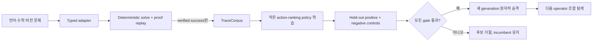

# Verifier-Gated Self-Learning v1

## 목표

SemOp의 자가 학습은 모델이 새 사실을 직접 써 넣는 방식이 아니다. 작은 정책이
typed operator의 실행 순서를 학습하고, 기존 executor가 모든 실행과 proof replay를
다시 검증한다. 학습 후보는 미사용 문제에서 기존 정책보다 안전하고 효율적일 때만
승격된다.



## 지금 실제로 학습하는 것

`StructuralLinearPolicy`는 replay-verified proof의 각 단계에서 정답 action과 hard
negative action을 비교한다. 이름 대신 다음 구조 신호를 사용한다.

- 목표와 effect의 정확한 일치, predicate/type 일치, argument overlap
- 새 effect 비율과 binding/precondition/effect 크기
- 범용 operator family
- typed precondition/effect shape와 안전한 구조 tag

학습은 dependency-free pairwise-margin update다. 현재 합성 3도메인 smoke run에서는
약 30개의 sparse weight만 생겼다. 이는 5.84M tiny controller를 대체한다는 뜻이
아니라, 자가 학습 루프와 승격 계약을 일반 PC에서 검증하는 가장 작은 기준선이다.
같은 `score_actions` 계약을 사용하므로 이후 NumPy tiny controller 학습기를 연결할
수 있다.

## 안전 계약

후보 정책은 action에 점수만 줄 수 있다. 다음 작업은 불가능하다.

- `WorldState`에 fact 직접 추가
- `proposed`나 `contradicted` fact를 proof 전제로 사용
- verifier가 확인하지 않은 halt 수용
- 실패 trace를 학습 corpus에 추가
- held-out gate 없이 policy artifact 승격

승격 기본 조건은 다음과 같다.

- 성공으로 보고한 proof soundness 100%
- negative control false positive 0
- incumbent 대비 verified solve rate 하락 1%p 이하
- 설정된 최소 expansion 감소율 충족
- policy 15M parameter 이하, artifact 64MB 이하
- held-out p95 CPU 시간 10초 이하

학습 label과 typed verifier가 충돌하면 해당 run 전체의 승격을 중단한다. 후보가
거절되면 incumbent object와 generation은 바뀌지 않는다.

## 실행

외부 runtime dependency 없이 실행할 수 있다.

```powershell
python examples/typed_self_learning_demo.py `
  --output artifacts/self_learning_run_01 `
  --examples-per-domain 3
```

CI나 A/B 기록에는 machine-readable 평가기를 사용한다.

```powershell
python tools/eval/evaluate_typed_self_learning.py `
  --examples-per-domain 3 `
  --output artifacts/self_learning_eval.json
```

예제는 서로 다른 seed로 학습/held-out 문제를 만든다. held-out에는 다음 음성
대조군도 자동으로 포함한다.

- 언어: 필수 전제의 `SATISFIED` fact 제거
- 수학: 계산 graph가 만들 수 없는 틀린 exact value 목표
- 비전: 검증된 비대칭 공간관계의 반대 방향 목표

출력의 핵심 필드는 `promoted`, `proof_soundness`, `false_positives`,
`expansion_reduction`, `generation`이다. 같은 저장소에서 계속하려면 새 seed와
`--resume`을 함께 사용한다.

```powershell
python examples/typed_self_learning_demo.py `
  --output artifacts/self_learning_run_01 `
  --seed 12 `
  --resume
```

## Python API

```python
from semop.kernel import (
    LearningSplit,
    SelfLearningBudget,
    SelfLearningLoop,
    generate_symbolic_curriculum,
    learning_tasks_from_synthetic,
)

train = learning_tasks_from_synthetic(
    generate_symbolic_curriculum(
        20, seed=1, curriculum="language-math-vision"
    ),
    split=LearningSplit.TRAIN,
    namespace="train-v1",
)
heldout = learning_tasks_from_synthetic(
    generate_symbolic_curriculum(
        20, seed=2, curriculum="language-math-vision"
    ),
    split=LearningSplit.HELDOUT,
    namespace="heldout-v1",
)

result = SelfLearningLoop(
    budget=SelfLearningBudget(min_expansion_reduction=0.10),
    store="artifacts/self-learning-v1",
).run(train, heldout)
```

실제 데이터에서는 문장이나 object 이름을 무작위로 나누지 말고 operator 조합,
그래프 구조, 문제 크기로 split해야 한다. `task_id`는 train과 held-out 전체에서
유일해야 한다.

## Checkpoint 구조

```text
self-learning-v1/
  manifest.json
  iterations/iteration-0001.json
  generations/generation-0001/policy.json
  traces/verified-traces.jsonl
  macros/retained-candidates.json
```

`manifest.json`은 policy, trace, macro artifact의 SHA-256을 기록한다. 저장은 임시
파일을 같은 디렉터리에 쓴 뒤 replace하는 방식이다. load/resume 시 hash가 다르면
실행을 거절한다.

Macro는 길이 2~6의 반복 sub-program을 MDL로 압축하고, held-out proof에서 같은
operator sequence가 재현되며 전체 proof replay가 성공할 때만 저장한다. v1의 macro
library는 의도적으로 `active: false`다. 아직 macro를 하나의 실행 operator로 등록해
성능을 바꾸지는 않으므로, 후보 보존을 실제 능력 향상으로 보고하지 않는다.

## Frontier LLM judge 연결

초기에는 frontier LLM을 teacher/judge로 사용할 수 있다. 다만 LLM 출력은
`proposed` 후보 또는 typed program review여야 한다. `teacher_review_to_solve_result`
가 현재 registry/state/goals에서 프로그램을 재실행하고 proof replay에 성공한 뒤에만
`TraceCorpus`로 들어갈 수 있다. judge의 자연어 평점만으로 policy를 승격하지 않는다.

## 현재 한계와 다음 단계

이번 v1이 달성한 것은 검증 가능한 **탐색 정책의 자가 개선**이다. 아직 다음을
자가 학습한다고 주장할 수는 없다.

- 새 언어 parser grammar와 새 predicate schema의 자동 발명
- raw image에서 새로운 visual concept를 발견하고 독립 검증하는 학습
- 실행 가능한 macro operator의 자동 등록과 rollback
- 장기 memory에서 curriculum을 능동 선택하는 continual learning
- 5.84M recurrent controller의 checkpoint-aware 자동 재학습

다음 구현 순서는 verified uncertainty 기반 curriculum 선택, NumPy tiny controller용
`PolicyLearner` adapter, executable macro sandbox, parser/perception proposal의
teacher-review queue다. 모든 단계는 같은 held-out 승격 gate를 유지한다.
