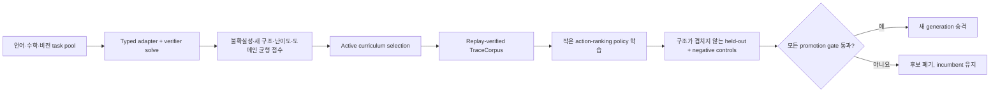

# Verifier-Gated Self-Learning v2

## 목표

SemOp의 자가 학습은 모델이 정답 fact를 직접 만들어 상태에 넣는 방식이 아니다.
작은 정책은 현재 typed state와 goal을 보고 **실행 가능한 operator의 순서**만 학습한다.
fact 추가, guard 검사, 목표 판정, proof replay는 항상 `OperatorKernel`이 담당한다.

이 경계 덕분에 학습 정책이 틀려도 잘못된 명제를 성공으로 보고할 수 없다. 정책이
예외를 내면 deterministic search로 복귀하고, 정책이 조기 중단을 제안해도 verifier
goal이 충족되지 않았으면 중단을 거부한다.



## 현재 학습 단위

정책이 실제로 학습하는 단위는 adapter가 만든 공통 typed IR이다. 공개 API에서는
`RawSelfLearningLoop`가 자유 입력 경계를 담당하므로 호출자가 `DomainInstance`를 미리
만들 필요는 없다. raw 언어 문자열, exact 수학 문자열, 작은 RGB raster는
`UnifiedTypedReasoner.ground`를 거친 뒤 아래 단위가 된다. grounding 실패와
train/held-out input·semantic fingerprint 중복은 학습 전에 차단한다. 자세한 계약과
실측은 `raw_grounded_self_learning.md`에 있다.

- 상태: 타입이 지정된 `Fact` 집합
- 목표: verifier가 검사할 `Goal` 집합
- 행동: registry가 실제로 grounding한 `GroundAction` 후보
- 정답: replay-verified proof에서 해당 단계에 실행된 action
- 오답: 같은 상태에서 실행 가능하지만 정답 trace에 속하지 않는 hard negative
- 종료: 최종 action 뒤 verifier goal이 모두 충족된 terminal state

`DecisionTrainingCase`는 마지막 proof 단계에 verifier가 확인한 terminal state와 goal을
함께 보존한다. 따라서 recurrent controller의 halt 양성 label도 성공 trace에서만
생성된다.

## 구조적 Transfer Split

이름이나 숫자만 바꾸는 seed split은 조합 전이를 증명하지 못한다. v2는 각 도메인의
두 capability 구조를 학습하고, 다른 한 구조 전체를 held-out으로 둔다.

| 도메인 | 학습 구조 1 | 학습 구조 2 | 완전 held-out 구조 |
|---|---|---|---|
| 언어 | 전제 복원과 readiness | 2-hop 개념 상속 | 2전제 conjunction rule chain |
| 수학 | 중첩 exact 연산 | 일차방정식 | 연산 결과의 exact 비교 |
| 비전 | 공간관계 추이 | pixel 기반 shape | closed count와 pixel area 비교 |

각 경로는 metadata fixture가 아니라 다음 실제 adapter를 실행한다.

- `LanguageTextAdapter`, `LanguageLogicAdapter`
- arithmetic, linear-equation, numeric-comparison adapter
- `VisionWorldAdapter`, `RasterVisionAdapter`

`audit_structural_split`은 다음 조건을 검사한다.

- train/held-out `structure_key` 교집합이 비어 있음
- 정규화된 replay proof `program_signature` 교집합도 비어 있음
- 양쪽 모두 language, math, vision을 포함함
- positive는 replay-verified solve, negative는 미증명이라는 label과 일치함
- operator sequence, family, depth, goal type shape가 기록됨

구조 이름만 다르고 실제 operator program이 같은 누수도 두 번째 검사에서 거부된다.

## Active Curriculum

`ActiveCurriculumScheduler`는 모든 합성 문제를 무조건 학습하지 않는다. 다음 신호로
작은 batch를 고른다.

- 현재 policy의 gold 대 hard-negative score margin 불확실성
- 아직 학습하지 않은 `structure_key`의 novelty
- verifier proof depth 기반 난이도
- language, math, vision 선택 수의 균형

기본 평가에서는 18개 training pool 중 서로 다른 6개 capability task를 선택한다.
도메인별 최소 선택 수를 지키면서 같은 구조의 반복 표본보다 새 구조를 우선한다.
verifier가 풀지 못한 positive와 decision supervision이 없는 trace는 학습에서 제외하고
각각 `rejected_unverified`, `rejected_no_supervision`으로 기록한다.

여러 generation을 실행할 때 이미 선택한 task는 다시 선택하지 않는다. 후속 후보가
승격되지 않아도 그 generation의 검증된 trace는 corpus에 남지만, 활성 정책은 마지막
승격 정책으로 롤백된다.

## 두 가지 작은 정책

### Sparse 기본 정책

`StructuralLinearPolicy`는 goal-effect 일치, predicate/type 일치, argument overlap,
operator family와 typed precondition/effect shape를 사용한다. dependency-free이고 수십
개의 parameter만 필요하므로 자가 학습 루프와 회귀 테스트의 기본 정책이다.

### Recurrent 선택 정책

`TinyControllerPolicyLearner`는 같은 `PolicyLearner` 계약을 구현한다.

- relation-aware recurrent NumPy runtime
- 기본 설정 약 5.84M parameter, 절대 상한 15M
- PyTorch는 학습 시에만 lazy import
- action/argument/halt/value/recursive-consistency loss
- verifier decision과 terminal case만 학습
- 메모리의 `.npz` bytes로 후보를 만들고 SHA-256 checkpoint로 저장 가능
- 추론과 복원에는 PyTorch가 필요하지 않음

순환망 후보도 sparse 정책과 동일한 held-out, proof replay, false-positive, 시간, 크기,
expansion gate를 통과해야 한다. 29K diagnostic 구성과 기본 5.84M 구성은 이제 언어 trace
3개만 사용하는 hierarchical transfer split에서 end-to-end 학습, NumPy 복원, 수학·비전
zero-shot 전이, macro 결합, 안전한 롤백을 통과한다. 다만 자유 입력과 human-reviewed
분포의 반복 결과는 아직 없으므로 기본값은 dependency-free sparse 정책이다.

## 승격과 롤백 조건

후보는 다음 조건을 모두 만족해야 활성 정책이 된다.

- 성공으로 보고한 proof soundness 100%
- negative-control false positive 0
- 전체 및 도메인별 verified solve-rate 하락 1%p 이하
- 설정한 최소 expansion 감소율 충족
- policy 15M parameter 이하
- artifact 64MB 이하
- held-out p95 CPU 시간 10초 이하
- train/held-out 구조와 program overlap 0

학습 label과 verifier 결과가 충돌하거나 어느 조건이라도 실패하면 candidate artifact는
활성 checkpoint에 들어가지 않으며 incumbent policy를 유지한다.

정책은 다음 작업을 할 수 없다.

- `WorldState`에 fact 직접 추가
- `proposed` 또는 `contradicted` fact를 proof 전제로 사용
- verifier가 확인하지 않은 halt 수용
- 실패 trace를 정답 corpus에 추가
- held-out gate 없이 자동 승격

## 실행

기본 sparse active learning 데모:

```powershell
python examples/typed_self_learning_demo.py `
  --output artifacts/self_learning_structural_01 `
  --examples-per-structure 3
```

Machine-readable A/B 평가:

```powershell
python tools/eval/evaluate_typed_self_learning.py `
  --examples-per-structure 3 `
  --output artifacts/self_learning_eval.json
```

Raw 입력에서 시작하는 language-only 학습과 math/vision 전이 평가:

```powershell
python tools/eval/evaluate_raw_grounded_self_learning.py `
  --controller-profile recurrent-diagnostic
```

현재 deterministic CPU 기준 결과는 다음과 같다.

- training pool 18개 중 6개 선택
- train structure 6개, held-out structure 3개, overlap 0
- positive expansion `51 -> 30`, 41.2% 감소
- verified solve rate 100%, proof soundness 100%, false positive 0
- `typed_structure` sparse policy 22 parameters

이 수치는 현재 controlled adapter 분포의 구조 전이 증거이며, 자유로운 언어·수학·비전
전체 능력의 완성을 뜻하지 않는다.

## 실제 Semantic Flow Holdout

기존 language/math/vision split은 세 도메인의 독립 task에서 공유 action ranking을
평가한다. 새 `generate_semantic_flow_transfer_split`은 한 단계 더 나아가 모든 양성
task가 하나의 proof 안에서 다음 흐름을 실행하도록 제한한다.

```text
vision measurement -> math comparison -> language conclusion
```

train에는 단일 조건과 서로 다른 selector의 2조건 conjunction만 둔다. held-out에는
같은 측정을 상·하한에 재사용하는 프로그램과 더 깊은 3조건 프로그램을 둔다. 이름만
바꾼 동일 proof가 섞이지 않도록 normalized operator program overlap도 0이어야 한다.
held-out 이미지는 더 크고, 숫자와 `number of`/한국어 문구도 새로 생성한다.

```powershell
python tools/eval/evaluate_semantic_flow_self_learning.py
```

2026-07-18 기본 CPU 측정에서는 training 4, held-out positive 4, negative 4를 사용했다.
positive expansion은 `44 -> 30`으로 31.8% 감소했고, proof soundness 100%, false
positive 0을 유지했다. 승격된 sparse policy는 21 parameters, 1,085 bytes였다.
상세 typed bridge 계약은 `typed_dataflow.md`에 있다.

## Python API

```python
from semop.kernel import (
    ActiveCurriculumConfig,
    ActiveCurriculumScheduler,
    ActiveSelfLearningLoop,
    LearningSplit,
    generate_lmv_structural_transfer_split,
    learning_tasks_from_synthetic,
)

split = generate_lmv_structural_transfer_split(3, seed=11)
train = learning_tasks_from_synthetic(
    split.training,
    split=LearningSplit.TRAIN,
    namespace="train-v2",
)
heldout = learning_tasks_from_synthetic(
    split.heldout,
    split=LearningSplit.HELDOUT,
    namespace="heldout-v2",
) + learning_tasks_from_synthetic(
    split.negative_controls,
    split=LearningSplit.HELDOUT,
    namespace="negative-v2",
    expected_solved=False,
)

result = ActiveSelfLearningLoop(
    scheduler=ActiveCurriculumScheduler(
        ActiveCurriculumConfig(max_tasks=6)
    ),
    store="artifacts/self-learning-v2",
).run(train, heldout)
```

선택적 recurrent learner를 쓸 때는 루프에 명시적으로 주입한다.

```python
from semop.tiny_controller import TinyControllerPolicyLearner

result = ActiveSelfLearningLoop(
    learner=TinyControllerPolicyLearner(epochs=1),
    scheduler=ActiveCurriculumScheduler(
        ActiveCurriculumConfig(max_tasks=6)
    ),
).run(train, heldout)
```

## Checkpoint

```text
self-learning-v2/
  manifest.json
  iterations/iteration-0001.json
  generations/generation-0001/policy.json 또는 policy.npz
  traces/verified-traces.jsonl
  macros/retained-candidates.json
```

manifest는 policy, trace, macro artifact의 SHA-256을 기록하고 임시 파일 뒤 atomic replace로
갱신한다. `SelfLearningLoop`는 checkpoint resume을 지원한다. active-pool wrapper는 같은
pool을 묵시적으로 재사용하지 않도록 현재 새 output root만 허용한다.

기본 `SelfLearningLoop`는 길이 2~6의 verified sub-program을 MDL로 압축하고 held-out
proof에 같은 sequence가 재현될 때 후보로 보존한다. 이 일반 policy 학습 루프는 macro를
묵시적으로 활성화하지 않으므로 checkpoint에 `active: false`와
`activation_supported: true`를 함께 기록한다.

절차 기억을 실제 탐색에 쓰려면 별도 `VerifiedMacroLearningLoop`를 사용한다. 이 루프는
train에서 후보를 유도하고, 독립 validation에서 동일한 primitive schema와 replay를 다시
확인한 후, held-out A/B gate를 통과한 library만 승격한다. 승격된 macro도 새 operator나
fact를 등록하지 않는다. `PrimitiveMacroPolicy`가 현재 실행 가능한 primitive action의
순위만 조정하며, 성공 proof는 기존 `OperatorKernel.replay`로 전부 재검증된다. 자세한 계약은
`docs/active_macro_learning.md`에 있다.

```powershell
python tools/eval/evaluate_active_macro_learning.py
```

`HierarchicalSelfLearningLoop`는 independently promoted controller와 macro library를
하나의 `HierarchicalOperatorBrain`으로 결합한다. controller held-out, macro
validation/held-out, final joint held-out을 분리하며, final set은 두 component의 모델 선택에
사용되지 않는다. joint가 controller-only와 macro-only보다 모두 적은 expansion을 기록하고
모든 기존 safety gate를 통과할 때만 combined artifact를 atomic replace한다.

```powershell
python tools/eval/evaluate_hierarchical_self_learning.py
```

세부 데이터 흐름과 artifact 계약은 `docs/hierarchical_operator_brain.md`에 있다.

## Frontier LLM Judge

초기에는 frontier LLM을 teacher 또는 judge로 사용할 수 있다. LLM 출력은 `proposed`
fact 또는 typed program review로만 취급한다. `teacher_review_to_solve_result`가 현재
registry, state, goals에서 프로그램을 재실행하고 replay에 성공한 경우에만
`TraceCorpus`에 들어간다. 자연어 점수만으로 policy를 승격하지 않는다.

## 아직 남은 범위

현재 구현은 실제 adapter 구조 사이의 **검증 가능한 탐색 정책 전이와 능동 curriculum**
단계다. 다음 능력은 아직 완성되지 않았다.

- 자유로운 자연어에서 grammar와 predicate schema를 스스로 획득하는 학습
- 자연 사진과 영상에서 새 visual concept와 시간 변화를 발견하고 검증하는 학습
- 기하·대수·증명 문제 전반의 정리 발명과 장기 proof search
- 새 인자 구조와 효과를 가진 macro schema 자체를 발명하는 학습
- 기본 5.84M recurrent controller의 multi-seed 및 더 깊은 composition 반복 실험
- 실제 분포의 human-reviewed 20/100-shot promotion gate

따라서 현재 상태를 언어·수학·비전의 최종 달성이나 AGI라고 표현하지 않는다.
